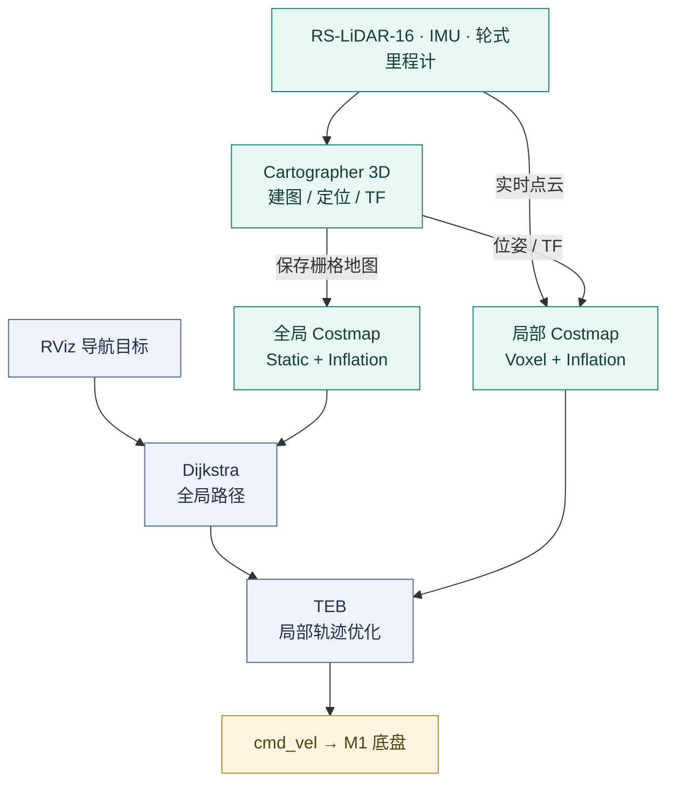

<div align="center">


# 3DSLAM-DuralROS

**把 SLAM、定位和路径规划，接到一台真正行驶的机器人上。**

**[古天琪 · Jack](https://github.com/JACKSKYHADES0910)｜项目作者**<br>
**罗开远 · Fred｜技术支持与项目参与**<br>
感谢 Fred 在项目开发过程中的参与和技术支持。

Field robotics · LiDAR SLAM · Autonomous navigation

[](#environment) [](#dual-ros) [](#hardware) [](LICENSE)

**[▶ 哔哩哔哩 · 完整中文项目介绍 · 5 分 35 秒](https://www.bilibili.com/video/BV1hQTqzZEsc/)**

[仿真与实车 GIF](#demo) · [系统架构](#architecture) · [完整部署教程](#environment) · [建图](#mapping) · [定位](#localization) · [导航](#navigation) · [2026 技术路线](#future)

</div>

<a id="overview"></a>
## 01 · 项目概述

这是一个以 **AutoLabor M1** 为平台的自动驾驶毕业设计，围绕室内外环境中的**建图、定位、导航与避障**展开。实车使用 RS-LiDAR-16、IMU 和轮式里程计获得环境与运动信息，通过 Cartographer 构建地图并恢复位姿，再由 move_base、Dijkstra 和 TEB 将导航目标转化为底盘速度指令。Kinect/YOLOv5 用于视觉检测实验；ROS1/ROS2 桥接与 Autoware.universe + AWSIM 构成另一条集成与仿真研究线。

本页将**原 README 的操作步骤与算法讲解**、**论文与答辩 PPT 的技术图和实验记录**、**新版中文视频的演示顺序**放在同一个项目框架中。完整教程就在本页，辅助文档用于追溯材料与维护记录。

| 项目主线 | 从输入到结果 | 在本页可以找到 |
| :-- | :-- | :-- |
| **仿真验证** | 虚拟道路 → 传感器与规划显示 → 模拟车辆响应 | AWSIM/Autoware 环境、启动流程与联合演示 |
| **实车建图** | LiDAR + IMU + Odometry → 点云匹配 → 地图与状态文件 | 三种建图路线、实验图、Cartographer 参数与地图保存 |
| **定位与导航** | 初始位姿 + 已有地图 → 全局路径 → 局部轨迹 → M1 | 轨迹服务、costmap、Dijkstra、TEB 与底盘控制 |
| **视觉与后续研究** | RGB 检测 → 几何关联/跟踪 → 可用于规划的障碍信息 | YOLOv5 原设计、当前源码范围与进一步集成方向 |

> 实车研究完成于 2024 年，中文项目视频于 2025 年公开，本页于 2026 年整理。历史材料、视频画面与当前公开源码分别说明不同阶段的工作；新技术章节属于候选方向。此次文档整理未重新进行实车验收。

### 阅读导航

| 展示与理解 | 环境与部署 | 原理与进阶 |
| :-- | :-- | :-- |
| [02 仿真 / 建图 / 实车 GIF](#demo) | [05 环境与驱动准备](#environment) | [07 三类 SLAM 与实验比较](#mapping) |
| [03 实验平台](#hardware) | [06 AWSIM 联合仿真](#awsim) | [10 地图加载与定位](#localization) |
| [04 系统架构与真实节点图](#architecture) | [08 工作空间、传感器与 TF](#start) | [11 导航、YOLOv5 与 TEB](#navigation) |
| [12 工程问题与实验记录](#lessons) | [09 实车建图与地图保存](#field-mapping) | [13 现代技术路线](#future) |
| [14 实现状态与源码导航](#status) | [原文保留索引](docs/CONTENT_MAP.md) | [15 团队、引用与致谢](#credits) |

<a id="demo"></a>
## 02 · 仿真与实车演示

下面三段 GIF 均截取自同一部中文项目视频，按原速循环播放。**点击任意 GIF，都跳转到 [哔哩哔哩完整视频](https://www.bilibili.com/video/BV1hQTqzZEsc/)**；首页不嵌入完整视频播放器。

### Simulation · Autoware × AWSIM

[](https://www.bilibili.com/video/BV1hQTqzZEsc/)

**36 秒片段 · 原片 01:10–01:46。** 左侧展示虚拟街道与车辆运动，右侧展示 RViz 中的点云、路线与车辆状态。两种视图结合，可以观察规划结果与模拟车辆响应之间的关系。

### Mapping · 校园实车建图

[](https://www.bilibili.com/video/BV1hQTqzZEsc/)

**36 秒片段 · 原片 02:27–03:03。** 相机画面提供场景参照，点云地图随机器人移动逐步形成。视频中的 Fusion SLAM 为历史讲解用语；本仓库可核实的 Cartographer 主输入是 LiDAR、IMU 和轮式里程计，未配置视觉观测进入该估计器。

### Navigation · 目标导航与局部避障

[](https://www.bilibili.com/video/BV1hQTqzZEsc/)

**40 秒片段 · 原片 04:36–05:16。** 观察全局路线、机器人附近的局部轨迹，以及图像中的检测框。画面展示了导航与检测实验；检测框怎样转换为规划器障碍输入，见 [YOLOv5 与规划接口](#vision)。

[▶ 在 B 站观看完整讲解与声音](https://www.bilibili.com/video/BV1hQTqzZEsc/) · [素材出处与片段时间](docs/EVIDENCE.md#media)


<a id="hardware"></a>
## 03 · 实验平台

| 部件 | 历史配置 | 在系统中的作用 |
| :-- | :-- | :-- |
| 移动底盘 | **AutoLabor M1** | 差速运动、编码器反馈与轮式里程计 |
| 激光雷达 | **RoboSense RS-LiDAR-16** | 环境点云、建图与障碍观测 |
| 惯性传感器 | **CH104M**；论文也记录了早期 AH100B | 角速度、加速度与姿态信息；以实际接线和 launch 为准 |
| 深度相机 | **Microsoft Kinect v2** | RGB/深度画面与视觉检测实验 |
| 上位机 | **HP OMEN · Intel i7-10750H** | 运行 ROS 与相关计算任务 |
| GPU | 原 README 记为 **RTX-2070Ti** | 保留原记录；准确型号需在原机复核 |
| 历史系统 | **Ubuntu 20.04 / ROS Noetic / ROS2 Galactic** | 复原当年的环境组合 |

驱动名称 `autolabor_pro1_driver` 与底盘配置 `M1` 同时出现在项目中；不要仅凭包名判断实车型号。硬件资料如下；原机分区、系统镜像与驱动迁移步骤见[环境准备](#environment)。

| 部件资料 | 原项目使用的入口 |
| :-- | :-- |
| 底盘 | [AutoLabor M1 操作手册](http://www.autolabor.com.cn/usedoc/m1/navigationKit/receivingGuide/inspection) |
| LiDAR | [RS16 历史驱动](https://gitee.com/xiaoxinslam/ros_rslidar) · [RoboSense rslidar_sdk](https://github.com/RoboSense-LiDAR/rslidar_sdk) |
| IMU | [HIPNUC / CH104M](https://github.com/hipnuc/products/tree/master) |
| 相机 | [Kinect v2 资料](https://learn.microsoft.com/en-us/windows/apps/design/devices/kinect-for-windows)；原 README 的 “Kinetic” 为拼写误差 |
| 上位机 | [HP OMEN](https://www.omen.com/cn/zh/laptops.html) |

<table>
<tr>
<td width="50%"></td>
<td width="50%"></td>
</tr>
<tr>
<td><b>传感器组合</b><br>相机提供图像，LiDAR 提供空间几何，IMU 与编码器描述运动。</td>
<td><b>实际装配</b><br>底盘、上位机、传感器、供电与线缆共同组成移动实验平台。</td>
</tr>
</table>

### 不同历史记录中的软件版本

原 README 记录 **Ubuntu 20.04 / ROS1 Noetic / ROS2 Galactic**；[新版视频简介](https://www.bilibili.com/video/BV1hQTqzZEsc/)还记录了**实车 Ubuntu 18.04 / ROS1 Melodic**及**仿真 Ubuntu 20.04**。这说明资料涉及不同部署阶段，不能把所有版本混成一个可直接安装的环境。

视频简介中的 “ROS2-NEOTIC” 是命名错误：Noetic 属于 ROS1。当前公开快照与本页主启动路径按仓库中的 ROS1 配置解释；恢复某次实验时，应同时锁定当次系统、驱动、依赖和参数。


<a id="architecture"></a>
## 04 · 系统架构与真实运行图

### 实车主链路 · ROS1



**3D 建图与地面导航承担不同的任务。** 本仓库的第三代配置使用 Cartographer 3D 处理点云、IMU 和里程计，导航侧使用二维栅格地图及包含点云观测的代价地图。仓库中 `campus.yaml` 的 **0.05 m/cell 是栅格分辨率**，不代表测量精度。

图中同时呈现建图与导航阶段。当前全局代价地图启用静态地图与膨胀层，Dijkstra 据此规划路线；实时点云进入局部体素层，供 TEB 调整附近的轨迹。[全局配置](src/launch/autolabor_navigation_launch/params/navigation/costmap/3d_global_costmap_params.yaml) · [局部配置](src/launch/autolabor_navigation_launch/params/navigation/costmap/3d_local_costmap_params.yaml)

初始化时，RViz 的 `2D Pose Estimate` 发布 `/initialpose`；仓库内的 `cartographer_initialpose` 将位姿转换为 Cartographer 的轨迹服务请求。之后由扫描匹配和位姿图约束持续估计位置。[查看实际实现](src/tool/cartographer_initialpose/src/cartographer_initialpose.cpp)

<a id="dual-ros"></a>
### 双 ROS 的工程背景

历史硬件驱动主要工作在 ROS1，而 Autoware.universe 使用 ROS2。论文记录了通过 `ros1_bridge` 交换消息的探索；AWSIM 联合仿真则是另一条实验路径。

| 路径 | 当时的目标 | 本仓库提供的内容 |
| :-- | :-- | :-- |
| **ROS1 实车** | 建图、定位、导航与底盘控制 | catkin 源码、launch、Lua/YAML、场地地图 |
| **ROS1 ↔ ROS2** | 连接既有驱动与 ROS2 软件生态 | 论文与 PPT 中的桥接说明；桥接工程需另行配置 |
| **Autoware + AWSIM** | 在虚拟街道运行自动驾驶软件栈 | 历史部署教程与演示截图；上游软件需独立安装 |

这里的 “DuralROS” 延续项目原名。它描述项目跨 ROS 版本的探索；当前源码并不是两份功能完全对等的 ROS1/ROS2 实车发行包。

### ROS1/ROS2 桥接时实际需要核对什么

论文记录了用 `ros1_bridge` 连接 ROS1 硬件与 ROS2 软件的探索。桥接前要核对消息类型、字段、坐标、时间戳和 QoS，自定义消息需要两侧类型支持；话题互通以后，还需适配 Autoware 的车辆控制接口。

上游要求在 ROS1/ROS2 可共同构建的环境中使用桥接，Ubuntu 24.04 不原生支持这一 ROS1 路径。[官方兼容说明](https://github.com/ros2/ros1_bridge#supported-ros-and-ubuntu-versions)。当前仓库没有完整桥接工作空间和版本锁定，因此保留为独立集成方向。

### 答辩材料中的实际 ROS 通信图

[](docs/assets/ros-node-graph.png)

这张图来自 PPT 的实车部署部分。可以沿三条线阅读：

1. **传感器 → 定位：** 雷达数据转换为 `/rslidar_points`，与 `/imu` 等信息进入 `cartographer_node`。
2. **地图与目标 → 规划：** `/map`、`/tf` 与 `/move_base_simple/goal` 支撑 `move_base` 输出全局和局部路径。
3. **规划 → 底盘 → 反馈：** `/cmd_vel` 驱动底盘运动，`/odom` 反馈运动估计；`/initialpose → cartographer_initialpose` 提供初始化入口。

<details>
<summary><b>展开论文引用的 AutoLabor 3D SLAM 架构图</b></summary>


来源为论文中的 AutoLabor 参考示意，保留原水印。它帮助理解编码器、定位、全局规划、局部规划和速度反馈的关系；图中包括厂商通用的前后单线雷达设计，实际传感器与活动配置以本仓库文件为准。

</details>


<a id="environment"></a>
## 05 · 环境与驱动准备

**本节来自原作者实操记录，可按需要选择。** 实车与仿真有不同的依赖，厂商镜像迁移和 FishROS 属于历史安装路径。

当时记录的组合是 Ubuntu 20.04、ROS1 Noetic 和 ROS2 Galactic，主机为 HP OMEN、i7-10750H。原文 GPU 名称 `RTX-2070Ti` 尚待原机核实；不以这个型号推导 CUDA、显存或 TensorRT 兼容性。

Noetic 已于 **2025-05-31** 结束官方支持，Galactic 的支持期已于 **2022-11** 结束。这里保留旧环境用于理解和复原历史项目；新开发环境应根据驱动与依赖选择 ROS2 的受支持版本。[ROS1 官方说明](https://www.ros.org/blog/noetic-eol/) · [ROS2 发布周期](https://github.com/ros2/ros2_documentation/blob/rolling/source/Releases.rst)

| 资料 | 用途 |
| :-- | :-- |
| [AutoLabor M1 手册](http://www.autolabor.com.cn/usedoc/m1/navigationKit/receivingGuide/inspection) | 底盘检查、接线与操作 |
| [AutoLabor 下载](http://www.autolabor.com.cn/download) | 与系统对应的底盘软件 |
| [RS-LiDAR 历史驱动](https://gitee.com/xiaoxinslam/ros_rslidar) | 原 README 提供的驱动入口 |
| [RoboSense rslidar_sdk](https://github.com/RoboSense-LiDAR/rslidar_sdk) | 上游驱动与传感器配置 |
| [HIPNUC 产品仓库](https://github.com/hipnuc/products/tree/master) | CH104M 等惯导资料 |
| [Kinect for Windows](https://learn.microsoft.com/en-us/windows/apps/design/devices/kinect-for-windows) | 原相机参考；Ubuntu 驱动结合仓库 `iai_kinect2-master` 阅读 |
| [HP OMEN](https://www.omen.com/cn/zh/laptops.html) | 原文主机产品入口 |

### 系统分区与厂商软件

原作者使用 Windows 10 + Ubuntu 20.04 双系统，参考 [HP OMEN 双系统安装笔记](https://blog.csdn.net/Robert_Q/article/details/115842915)。原分区为 `/` 250 GB、`/boot` 10 GB、swap 32 GB、EFI 1 GB、`/home` 剩余约 707 GB。这是原机记录，不是最小磁盘要求。

旧驱动可能缺失或需手动适配。原文提出从官方获得 Ubuntu 20.04/Noetic 软件，或在另一台机器安装厂商镜像后备份 `catkin_ws`，再迁移到运行主机并适配 `cmd_vel`。

原下载条目标为 **“AutolaborOS-24.04-amd64.iso (Ubuntu18.04 ROS Melodic)”**，文件名与括号内版本有歧义。保留[原下载入口](http://www.autolabor.com.cn/download?hmsr=gwstastics&hmpl=os&hmcu=24.04)，以镜像发行说明为准；不要把 Melodic 构建产物直接当作 Noetic 编译结果。

原文推荐[鱼香 ROS 安装说明](https://fishros.org.cn/forum/topic/20/%E5%B0%8F%E9%B1%BC%E7%9A%84%E4%B8%80%E9%94%AE%E5%AE%89%E8%A3%85%E7%B3%BB%E5%88%97)与 [fishros/install](https://github.com/fishros/install)。原作者使用的安装命令作为历史步骤保留：

```bash
wget http://fishros.com/install -O fishros && . fishros
```

使用前按上游说明获取、查看脚本，并确认所选系统与 ROS 版本。

原先通过另一台电脑安装厂商系统、将 `catkin_ws` 备份到 U 盘再迁移的办法，保留了驱动与配置，也可能带来绝对路径和二进制兼容问题。迁移后需要重新确认底盘 `cmd_vel` 接口、串口、传感器参数及编译结果；不要把 Melodic 的构建产物直接用于 Noetic。


<a id="awsim"></a>
## 06 · Autoware 与 AWSIM 联合仿真

原文记录 [Autoware.AI](https://github.com/autowarefoundation/autoware_ai)、[Autoware.universe](https://github.com/autowarefoundation/autoware.universe) 及 [Universe 安装笔记](https://blog.csdn.net/zardforever123/article/details/132528899)。GPU 驱动、CUDA、TensorRT、cuDNN 与 ROS 应匹配所选上游版本；Autoware 不是本仓库 ROS1 导航的前置依赖。

该 CSDN 历史笔记在本次链接检查中被网站拦截，未能验证正文；入口予以保留，安装以对应版本的官方文档为准。

以下为 **AWSIM v1.0.1 历史流程**，参考[对应官方文档](https://github.com/tier4/AWSIM/blob/v1.0.1/docs/GettingStarted/QuickStartDemo/index.md)，不适用于任意当前 Autoware 版本。

### 6.1 DDS 与依赖

原文设置环境的位置应为 `~/.bashrc`。建议先在专用终端验证，再决定是否持久化：

```bash
export ROS_LOCALHOST_ONLY=1
export RMW_IMPLEMENTATION=rmw_cyclonedds_cpp

if [ ! -e /tmp/cycloneDDS_configured ]; then
    sudo sysctl -w net.core.rmem_max=2147483647
    sudo ip link set lo multicast on
    touch /tmp/cycloneDDS_configured
fi

sudo apt update
sudo apt install libvulkan1 unzip
```

`ROS_LOCALHOST_ONLY=1` 对应同机仿真场景，多机通信不要照搬。

### 6.2 程序、权限与地图

下载 [AWSIM_v1.0.1.zip](https://github.com/tier4/AWSIM/releases/download/v1.0.1/AWSIM_v1.0.1.zip) 与 [nishishinjuku_autoware_map.zip](https://github.com/tier4/AWSIM/releases/download/v1.0.0/nishishinjuku_autoware_map.zip)。地图地址中的 v1.0.0 是原教程的组合。

```bash
cd ~/Downloads
unzip AWSIM_v1.0.1.zip
unzip nishishinjuku_autoware_map.zip

# 替换为解压后的模拟器目录
cd /path/to/AWSIM
chmod +x AWSIM.x86_64
./AWSIM.x86_64
```

原文将地图置于启动文件旁，关键是 `map_path` 指向真实地图目录。权限操作参考[原权限截图](https://github.com/tier4/AWSIM/raw/v1.0.1/docs/GettingStarted/QuickStartDemo/Image_1.png)与[联合仿真截图](https://github.com/tier4/AWSIM/raw/v1.0.1/docs/GettingStarted/QuickStartDemo/Image_Initial.png)。

### 6.3 配套 Autoware

在另一个设置相同 DDS 环境的终端中运行历史命令：

```bash
cd ~/autoware_universe
source install/setup.bash
ros2 topic list
ros2 launch autoware_launch e2e_simulator.launch.xml \
  vehicle_model:=sample_vehicle \
  sensor_model:=awsim_sensor_kit \
  map_path:=/absolute/path/to/nishishinjuku_autoware_map
```

检查传感器、定位、路线、控制反馈与模拟车辆响应，不能仅以窗口打开作为成功。新环境请从 [Autoware 官方文档](https://autowarefoundation.github.io/autoware-documentation/main/)选择配套版本。

编辑用户配置时，原文的 `sudo gedit ./bashrc` 应更正为用户目录中的文件，例如 `gedit ~/.bashrc`；通常不需要以管理员权限编辑自己的 shell 配置。地图可按原文放在模拟器旁，也可位于其他目录，启动命令中的 `map_path` 必须与之对应。

<details>
<summary><b>AWSIM 原教程的权限设置与联合启动截图</b></summary>


以上两图来自 AWSIM 上游 v1.0.1 教程，保留原始出处。

</details>


**从视频中观察闭环：** 不仅看车辆有没有移动，还要看规划路线与车辆响应是否一致、传感器和地图能否对齐、路口转向后定位能否持续。仿真可以反复设置同一任务，实车则还要处理供电、振动、反射、轮滑与驱动差异。


<a id="mapping"></a>
## 07 · 建图方案：原理、对比与选择

团队试验过 **LeGO-LOAM、NDT Mapping、Cartographer（有/无轮式里程计）**，最终采用带里程计的 Cartographer。这里保留原 README 的七个比较维度，并结合论文/PPT 的实验图解释选择过程。

<table>
<tr>
<td width="33%"></td>
<td width="33%"></td>
<td width="34%"></td>
</tr>
<tr>
<td><b>NDT Mapping</b><br>论文图 23，花园试验中的点云输出。</td>
<td><b>LeGO-LOAM</b><br>论文图 25，地面车辆场景的点云建图。</td>
<td><b>Cartographer + Odometry</b><br>论文图 28，团队后续采用的方案。</td>
</tr>
</table>

这三张图来自不同试验与显示方式，用于呈现实际探索过程；它们并非相同数据、视角、参数和真值条件下的公平 benchmark。

### 7.1 七个维度怎样比较

| 比较维度 | LeGO-LOAM | NDT Mapping / ndt_map | Cartographer |
| :-- | :-- | :-- | :-- |
| **坐标接入** | 核对点云轴向、TF 与外参；不能因旧文“左手系”说法断言不兼容 | 与 ROS/Autoware 接口对齐 frame、单位和外参 | 通过 map/odom/base_link/传感器 frame 建立一致坐标关系 |
| **实时性** | 地面分割和特征处理降低运算量，仍取决于输入与参数 | 本项目观察到较高 CPU 占用；具体实现与分辨率影响明显 | 前端与后端分工；线程、采样与优化频率影响延迟 |
| **精度** | 需结合地面假设、特征、运动与标定验证 | 配准初值、网格分辨率、运动畸变和噪声均会影响结果 | 轮式里程计辅助约束，团队观察到地图更连续；没有统一数值排名 |
| **回环检测** | 上游包含基础 ICP 回环，漂移过大时有限制 | NDT 本身是配准方法；原链接 ndt_map 另实现了基于里程计的回环 | 通过节点与子地图约束进行回环和位姿图优化 |
| **环境适用性** | 适合能可靠提取地面与几何特征的地面机器人场景 | 可用于几何配准与地图构建；动态物体仍需独立处理 | 可用于室内外 2D/3D SLAM，依赖传感器质量与场景约束 |
| **硬件需求** | 关注点云规格与 CPU 负载 | CPU/GPU 取决于所选库，GPU 不是 NDT 的必需条件 | 关注 IMU、点云、内存与后端计算开销 |
| **安装配置** | ROS/catkin、GTSAM、Eigen/PCL 及传感器参数 | ROS/catkin、NDT 库、GTSAM、点云/里程计/IMU 接口 | Cartographer/ROS 接口、Ceres 等依赖、Lua 配置与 TF |

### 7.2 LeGO-LOAM：地面优化与 6DoF 位姿

**Lightweight and Ground-Optimized LiDAR Odometry and Mapping** 面向地面车辆，利用分割后的地面与几何特征估计六自由度位姿。它沿用 LOAM 的里程计与建图分工思想，通过曲率等特征选取边缘点、平面点，降低直接处理全部点云的负担。上游包含基础 **ICP 回环**；原文把 ICP 泛化为所有连续帧匹配、把回环写成“不支持”，均需按具体实现纠正。

原项目关注静态/平坦场地的高效建图。接入 RS16 时，重点是线束、点云投影、地面提取和 IMU/LiDAR 对齐，不能仅改变话题名称。[LeGO-LOAM 官方源码与说明](https://github.com/RobustFieldAutonomyLab/LeGO-LOAM)

原 README 的 clone、依赖安装和编译主题在这里保留，构建方式改为上游使用的 catkin 工作空间。上游列出的测试环境包含 Indigo/Kinetic/Melodic，Noetic 适配需要自行验证；它不是“只能运行在 Noetic”的算法。

```bash
# 先按上游所选版本配置 ROS、GTSAM、Eigen/PCL 等依赖
mkdir -p ~/lego_ws/src
cd ~/lego_ws/src
git clone https://github.com/RobustFieldAutonomyLab/LeGO-LOAM.git
cd ~/lego_ws
rosdep install --from-paths src --ignore-src -r -y
catkin_make -j1
source devel/setup.bash
# 完成传感器/TF/时间参数适配后再启动
roslaunch lego_loam run.launch
```

原文在仓库根目录直接 `mkdir build && cd build; cmake ..; make` 的写法不适合作为这个 ROS 包的通用安装步骤；所需源码和依赖应按选定上游版本组织。

### 7.3 NDT：用栅格内的统计分布配准

**Normal Distributions Transform** 将参考点云划分到空间网格，以网格内点的均值和协方差描述局部几何，再优化新扫描相对于参考分布的位姿。这是原 README 中“栅格建模 → 点云匹配 → 地图更新”的核心。NDT 的配准初值、网格尺度与运动畸变会影响收敛；移动目标不会因为使用正态分布而自动消失。[PCL 官方 NDT 教程](https://pointclouds.org/documentation/tutorials/normal_distributions_transform.html)

原文引用的 [jyakaranda/ndt_map](https://github.com/jyakaranda/ndt_map) **确实集成了基于里程计、参考 LeGO-LOAM 的回环**，同时列出 GTSAM、ndt_cpu、ndt_gpu 等依赖。这应与“NDT 算法天然带回环”区分。该仓库是否就是论文中 NDT 实验的确切版本，目前未锁定。

```bash
# 在独立 catkin 工作空间中准备源码
mkdir -p ~/ndt_ws/src
cd ~/ndt_ws/src
git clone https://github.com/jyakaranda/ndt_map.git
cd ~/ndt_ws

# 先补齐所选版本的 GTSAM / ndt_cpu / ndt_gpu 等依赖
rosdep install --from-paths src --ignore-src -r -y
catkin_make
source devel/setup.bash
# 按上游适配点云、Odometry、IMU 和 TF 后再运行
roslaunch ndt_map test.launch
```

这是按 ROS 包结构整理的参考流程，未在本次文档更新中编译。原文在包根目录单独 `cmake/make` 的步骤不再作为一键运行保证。对于复杂、动态环境，应同时评估动态点过滤与初值质量；不能仅以“有回环”推断适合所有动态场景。

### 7.4 Cartographer：局部子地图与全局图优化

Cartographer 支持 **2D/3D** 建图与定位。局部前端进行扫描匹配并形成子地图；全局后端寻找扫描与子地图之间的约束，将局部结果放到一致的位姿图中。LiDAR 描述环境几何，IMU 帮助估计姿态和重力方向，轮式里程计提供运动信息。回环约束有助于降低累积漂移，其效果仍依赖可观测的环境与正确的数据。[算法说明](https://google-cartographer-ros.readthedocs.io/en/latest/algo_walkthrough.html)

团队选用这一方案的原因是：有里程计的校园试验中，地图连续性与定位稳定性更符合项目需要；现有驱动、ROS Navigation 和地图复用流程也更容易接起来。坐标兼容依靠正确的 TF 与接口，而非仅凭“使用右手系”就完成 Autoware 集成。

**原 README 中的独立上游构建流程：**

```bash
sudo apt-get update
sudo apt-get install -y python3-wstool python3-rosdep ninja-build
mkdir -p ~/cartographer_ws/src
cd ~/cartographer_ws
wstool init src
wstool merge -t src https://raw.githubusercontent.com/cartographer-project/cartographer_ros/master/cartographer_ros.rosinstall
wstool update -t src
rosdep update
rosdep install --from-paths src --ignore-src --rosdistro="${ROS_DISTRO}" -y
catkin_make_isolated --install --use-ninja
```

Eigen、PCL、Ceres 等依赖应结合实际软件包与版本核对。以上适合阅读上游安装过程；复原本项目应优先保留仓库中的定制代码与 Lua 参数，按下一节构建整个工作空间。[Cartographer 上游](https://github.com/cartographer-project/cartographer)

### 7.5 怎样选择

- **关注实时性与地图连续性：** 可以从本项目的 Cartographer + Odometry 基线开始，测量前端延迟和后端优化开销。
- **主要在可观察地面的场地行驶：** LeGO-LOAM 是值得比较的路线，先确认点云投影和地面分割适配。
- **研究 NDT/Autoware 配准或复杂动态环境：** 先锁定具体实现，明确初值、动态点处理与回环模块，再用同一记录比较。

原文“LeGO 无回环/天然不适配右手系”“NDT 必然支持回环且需要 GPU”“Cartographer 依靠 NDT+ICP 处理动态环境”等判断在上述对应位置作了更正。三类算法的原理、依赖、安装主题、选择场景与七维比较均保留在本页。


<a id="start"></a>
## 08 · 工作空间、传感器与 TF

```bash
git clone https://github.com/JACKSKYHADES0910/3DSLAM-DuralROS.git
cd 3DSLAM-DuralROS
```

<a id="preflight"></a>
### 8.1 先补齐真实依赖

当前仓库是实验工作空间快照，以下问题可在源码与 Git 树中定位：

| 检查点 | 当前记录 | 处理方向 |
| :-- | :-- | :-- |
| 子仓库 | 有 8 个 gitlink，根目录缺少 `.gitmodules` | 补齐下载地址与对应提交；仅 `--recursive` 不能恢复缺失映射 |
| LiDAR 驱动 | `src/driver/lidar/rslidar_sdk` 是 gitlink | 恢复原驱动版本，确认 RS16 配置与 `/rslidar_points` |
| LiDAR 配置 | 活动节点的 `config_path` 为空 | 指向本机真实 YAML |
| 底盘串口 | `/dev/ttyUSB_custom0 ` 有尾随空格 | 改为真实设备路径，检查 udev 与权限 |
| 雷达型号 | `lidar3d` 写作 `rs16 ` | 核对 xacro 条件与型号，处理尾随空格 |
| IMU | `/dev/ttyUSB_custom1` | 核对设备、波特率、安装方向与话题 |
| 地图 | 默认 `campus.pbstream` 与 `campus.yaml` | 使用同一次建图生成的配套文件 |
| 构建产物 | 包含原机 build/devel/install 目录 | 在新的工作空间编译 |
| YOLO / ROS2 | 缺少完整检测适配节点和 ROS2 工作空间 | 作为独立集成工作补齐 |

定位文件：[底层启动](src/launch/autolabor_navigation_launch/launch/real_environment/third_generation_base.launch) · [导航入口](src/launch/autolabor_navigation_launch/launch/real_environment/third_generation_navigation_3d.launch)。本次文档更新标明这些问题，没有改动实车源码。

<a id="build"></a>
### 8.2 从源码重新构建

下面是**依赖补齐后的参考顺序**，不是已验证的一键安装器。另建工作空间，避免旧缓存和原机绝对路径干扰。

```bash
# Ubuntu 20.04 + 已安装的 ROS Noetic
source /opt/ros/noetic/setup.bash
sudo apt update
sudo apt install python3-rosdep ninja-build

# 仅在 rosdep 尚未初始化时执行 sudo rosdep init
rosdep update

# 将占位路径替换为真实克隆目录，目标应是新的工作空间
mkdir -p ~/3dslam_ws/src
cp -a /path/to/3DSLAM-DuralROS/src/. ~/3dslam_ws/src/
cd ~/3dslam_ws

# 此前需恢复上节指出的 gitlink 依赖
rosdep install --from-paths src --ignore-src --rosdistro noetic -r -y
catkin_make_isolated --use-ninja
source devel_isolated/setup.bash
```

如果依赖安装或编译失败，先处理对应包，避免继续加载不完整的工作空间。这里使用 `devel_isolated`：仓库中的主 launch 包及部分驱动/工具缺少完整安装规则，单独加载 `install_isolated` 会遗漏必要的启动文件、参数或节点。


<a id="sensors"></a>
### 8.3 检查传感器、时间与坐标

完成配置检查后，先启动底层硬件。建图/导航入口也会包含该文件，避免重复启动同名节点。

```bash
roslaunch autolabor_navigation_launch third_generation_base.launch

# 在另一个已 source 同一工作空间的终端检查
rostopic list
rostopic hz /rslidar_points
rostopic hz /odom
rostopic echo -n 1 /odom
rosrun tf tf_echo base_link imu_link
```

点云应有正确 `frame_id` 与递增时间戳。IMU 话题名以驱动输出为准，检查角速度、线加速度、姿态和单位；里程计方向应与实际运动一致。配置使用 `map`、`odom`、`base_link`、`imu_link`，TF 树应连续，并避免重复发布同一变换。

第三代建图配置为 `use_odometry = true`、`num_point_clouds = 1`、`num_laser_scans = 0`、`tracking_frame = "imu_link"`，启用 3D trajectory builder；`points2` 重映射到 `rslidar_points`。原文 2D `velodyne_scan` 示例不对应这条输入链路。

Kinect 用于 RGB/深度和视觉检测实验。材料中的 Visual SLAM、VINS-Mono 与融合 SLAM 是背景知识，不代表当前 Cartographer 已融合相机观测。

论文和 PPT 记录了 IMU 姿态显示、雷达点云、轮式里程计消息与 Kinect 深度画面的验证过程。复现时逐项确认：

| 数据 | 可观察的检查 | 与后续算法的关系 |
| :-- | :-- | :-- |
| LiDAR | 点云频率、frame_id、时间戳、近远处结构 | 影响扫描匹配与障碍观测 |
| IMU | 四元数、角速度、线加速度是否随运动合理变化 | 影响姿态估计与初始化 |
| Odometry | 前进/转弯方向、位移尺度、轮径和轮距 | 影响运动预测与轮滑误差 |
| Kinect | RGB/深度画面、对应关系与标定 | 影响检测和后续几何关联 |

TF 说明“传感器装在哪里”，时间戳说明“这条观测发生在什么时候”。设备能发布消息之后，还需要核对两者，才能把数据放入一致的机器人坐标与时间体系。


<a id="field-mapping"></a>
## 09 · 实车建图与地图保存

底层数据正常后，停止单独运行的底层 launch，启动包含驱动的建图入口：

```bash
roslaunch autolabor_navigation_launch third_generation_cartographer_3d.launch
```

确认 RViz 中点云、TF、轨迹与栅格随运动变化。使用经过校准的底盘控制稳定采集，回到已访问区域观察闭环约束与地图一致性。地图精度还需要场地测量与记录支撑，不能仅凭视觉判断。

`.pbstream` 保存 Cartographer 状态；`.pgm + .yaml` 提供导航使用的栅格地图。

```bash
# 确认活动轨迹 ID
rosservice call /get_trajectory_states "{}"

# 0 仅为示例，替换为上一步返回的活动轨迹 ID
rosservice call /finish_trajectory "{trajectory_id: 0}"

# 路径位于 cartographer_node 所在主机，目录需要预先存在
rosservice call /write_state "{filename: '/absolute/path/campus.pbstream', include_unfinished_submaps: true}"
rosrun map_server map_saver -f /absolute/path/campus
```

检查服务返回状态、文件大小、YAML 的 `image` 路径、分辨率与原点。导航时加载这组配套文件。仓库中的校园地图可以用来观察格式，新的物理场地需要自己的地图。

### 当前主配置的关键参数

```lua
-- 摘自 third_generation_mapping.lua
options.tracking_frame = "imu_link"
options.use_odometry = true
options.num_point_clouds = 1
options.num_laser_scans = 0
MAP_BUILDER.use_trajectory_builder_3d = true
TRAJECTORY_BUILDER_3D.use_online_correlative_scan_matching = true
TRAJECTORY_BUILDER_3D.submaps.num_range_data = 60
MAP_BUILDER.num_background_threads = 4
```

这些值描述当前快照，不是所有硬件的通用最佳值。仓库 occupancy grid 节点还包含 `unknow_as_free` 扩展；换成未包含该改动的上游节点时，不能照搬全部 launch 参数。[自定义源码](src/mapping/cartographer_ros/cartographer_ros/cartographer_ros/occupancy_grid_node_main.cc)


原 README 中 `/finish_trajectory 0` 与 `/write_state` 的简写意图保留为上面的完整服务流程。先确认活动轨迹 ID，再结束轨迹、保存状态，最后保存导航栅格；`.pbstream` 不是 rosbag 数据录制文件。


<a id="localization"></a>
## 10 · 实车定位：手动初始化与持续匹配

原项目采用“**先给定初始位姿，再自动持续定位**”的策略。首次启动时，在已建地图上确认机器人真实位置，调整朝向，使地图坐标与现场一致；同时确认 LiDAR、IMU、里程计和 TF 正常。这里的手动操作是位姿初始化，不替代传感器外参标定。

### 10.1 加载保存状态

仓库实际使用命令行 flag 加载状态：

```xml
<node name="cartographer_node" pkg="cartographer_ros"
      type="cartographer_node"
      args="-configuration_directory $(find autolabor_navigation_launch)/params/cartographer
            -configuration_basename third_generation_location.lua
            -load_state_filename $(find autolabor_navigation_launch)/map/campus.pbstream"
      output="screen">
  <remap from="points2" to="rslidar_points" />
</node>
```

`third_generation_location.lua` 继承 3D 配置，启用 `pure_localization_trimmer`，保留 3 个活动子地图，设置 `publish_frame_projected_to_2d = true`。它在保存地图上持续匹配，为地面导航提供位姿。

在 RViz 用 **2D Pose Estimate** 给出当前位置与朝向。`cartographer_initialpose` 接收 `/initialpose`，结束当前活动轨迹，再请求 `/start_trajectory`，设置 `use_initial_pose` 和相对轨迹。这个流程不等于运行 AMCL 粒子滤波器。

原文的初始位姿与 2D 参数在下方逐项对照；它们不能直接替代上述 3D 配置。

原文讨论的 `huber_scale`、`optimize_every_n_nodes`、`constraint_builder.min_score` 与 `global_localization_min_score`，分别影响鲁棒优化、优化频率和约束接受门限。应使用相同记录逐项比较，而不把参数视为“自动消除动态物体”的保证。场地显著变化后应更新或重建地图。

### 10.2 从手动位姿到自动定位

1. **初始位置与姿态：** 在 RViz 点击 `2D Pose Estimate`，按实际位置和方向放置初始位姿。
2. **轨迹服务：** `cartographer_initialpose` 根据 `/initialpose` 结束当前活动轨迹，再启动带初始位姿的新轨迹。
3. **前端扫描匹配：** 将当前扫描与局部地图匹配，结合运动信息不断更新位姿。
4. **IMU 与全局约束：** IMU 提供姿态相关信息，节点与子地图约束帮助维持地图中的一致位置；回环/全局约束并不保证所有场景都能消除漂移。
5. **持续观测：** 关注匹配状态、TF、位姿跳变和局部地图变化。环境显著变化后，应更新或重建地图。

### 10.3 原初始位姿配置与当前实现的对应

| 原 README 字段 | 原示例值/接口 | 本仓库实际使用方式 |
| :-- | :-- | :-- |
| `use_sim_time` | `false` | 实车通常使用真实时钟；bag/仿真是否使用模拟时钟需分别配置 |
| `initial_pose_x` / `initial_pose_y` / `initial_pose_a` | `0.0 / 0.0 / 0.0` | 当前代码通过 `/initialpose` 与轨迹服务传递位姿，普通 ROS 参数不会自动完成初始化 |
| 激光重映射 | `scan → velodyne_scan` | 当前 3D 入口为 `points2 → rslidar_points` |
| 地图加载 | 普通 param `load_state_filename` | 当前节点读取命令行 flag `-load_state_filename` |

原示例讨论的位置、朝向、时钟和传感器输入仍是必须配置的内容；上表说明怎样把它们对应到当前源码。

### 10.4 原 2D 参数与当前 3D 参数对照

| 原 2D 定位记录 | 原值 | 本项目 3D 入口的处理 |
| :-- | :-- | :-- |
| `TRAJECTORY_BUILDER.pure_localization` | `true` | 使用 `pure_localization_trimmer` 保留 3 个活动子地图 |
| `TRAJECTORY_BUILDER_2D.min_range` | `0.3` | 3D 需核对相应 3D 参数与实际有效距离 |
| `TRAJECTORY_BUILDER_2D.max_range` | `30.0` | 同上，不直接套用 2D 范围 |
| `TRAJECTORY_BUILDER_2D.use_imu_data` | `true` | 3D 输入链路需要有效 IMU 数据 |
| `TRAJECTORY_BUILDER_2D.use_online_correlative_scan_matching` | `true` | 当前 3D 同类配置为 `true` |
| `TRAJECTORY_BUILDER_2D.submaps.num_range_data` | `35` | 当前 3D 建图配置为 `60` |
| `MAP_BUILDER.use_trajectory_builder_2d` | `true` | 当前选择 `use_trajectory_builder_3d = true` |

```lua
-- 当前 third_generation_location.lua 的关键项
include "third_generation_mapping.lua"
options.publish_frame_projected_to_2d = true
TRAJECTORY_BUILDER.pure_localization_trimmer = {
  max_submaps_to_keep = 3,
}
POSE_GRAPH.optimize_every_n_nodes = 50
```

### 10.5 动态环境、优化频率与误差管理

保留原 README 的四个调参项及数值，作为历史参数讨论：

```lua
-- 原 README 示例值；不是当前 launch 的完整活动配置
POSE_GRAPH.optimization_problem.huber_scale = 1e1
POSE_GRAPH.optimize_every_n_nodes = 90
POSE_GRAPH.constraint_builder.min_score = 0.55
POSE_GRAPH.constraint_builder.global_localization_min_score = 0.6
```

| 参数 | 主要作用 | 调整时需要观察 |
| :-- | :-- | :-- |
| `huber_scale` | 鲁棒损失的尺度 | 异常约束与优化结果，不等于自动剔除所有动态目标 |
| `optimize_every_n_nodes` | 后端优化触发频率 | 位姿修正速度与计算开销；当前定位 Lua 为 `50` |
| `min_score` | 局部约束匹配接受门限 | 约束数量、误匹配和恢复能力 |
| `global_localization_min_score` | 全局定位约束门限 | 错误恢复与漏匹配之间的取舍 |

原文将动态适应性归因于“NDT 和 ICP”，并描述自动调整参数；当前 Cartographer 链路应按扫描匹配、子地图和位姿图优化解释，仓库没有证据支持通用的自动调参闭环。应保存相同 bag，逐项比较参数，并记录定位误差、CPU 开销、失败与恢复过程。

**地图复用检查：** `.pbstream` 路径存在且可读；加载状态与 `.yaml/.pgm` 配套；机器人位置和朝向正确；场地变化后及时更新地图。这样可以在重复任务中复用已建地图，而不必每次从零构图。


<a id="navigation"></a>
## 11 · 实车导航、视觉检测与局部避障

### 11.1 下发目标并运行导航

地图、驱动与传感器配置完成后：

```bash
roslaunch autolabor_navigation_launch third_generation_navigation_3d.launch
```

该入口启动底层驱动、Cartographer 定位、map_server、initialpose 工具、move_base 与 RViz，不要同时运行建图 launch。先初始化并观察定位，再用 **2D Nav Goal** 设定目标。实车试验在可控场地进行，确认急停与人工接管可用。

1. `global_planner/GlobalPlanner` 生成全局路径，当前 `use_dijkstra: true`。PPT 的 A* 属于算法讲解，切换需要单独评估。
2. `teb_local_planner/TebLocalPlannerROS` 优化带时间信息的局部轨迹，综合运动学、速度与障碍约束。配置中的 `max_vel_x: 0.2` 是规划器速度上限，不是底盘最大速度或实测平均速度。
3. 局部 costmap 的体素层使用 `rslidar_points` 的 `PointCloud2` 观测标记/清除障碍；当前全局 costmap 只启用静态地图与膨胀层。footprint 与膨胀范围应按实际车体配置。
4. `/cmd_vel` 交给底盘驱动；检查方向、限速、串口与里程计反馈。

### 11.2 move_base、Dijkstra 与 TEB 各做什么

**move_base 是组织导航的 ROS 包。** 它接收目标位姿，结合当前定位与代价地图，调用全局和局部规划插件。LiDAR、里程计、地图和 TF 通过各自接口支撑导航，最终形成底盘速度指令。

**Dijkstra 负责全局路径。** 它在地图所形成的搜索空间中寻找从起点到目标的低代价路径，作为局部规划的参考。当前 `GlobalPlanner` 设置 `use_dijkstra: true`；PPT 中讲解的 A* 也是图搜索方法，但不是这份配置的活动选择。

**Timed Elastic Band（TEB）负责局部轨迹。** 它把位姿和相邻位姿的时间间隔一同放进优化问题，在全局路线附近综合障碍距离、速度、加速度和运动学约束调整轨迹。机器人附近出现障碍时，局部地图的变化会影响轨迹；底盘能否正确执行，还取决于控制接口、限速与运动模型。

<table>
<tr>
<td width="50%"></td>
<td width="50%"></td>
</tr>
<tr>
<td><b>Global plan</b><br>从当前位置到目标的整体路线。</td>
<td><b>Local trajectory</b><br>结合附近障碍和运动约束调整的短程轨迹。</td>
</tr>
</table>

<a id="vision"></a>
### 11.3 检测到规划之间的接口

论文和视频展示 YOLOv5 检测及其与 TEB 配合的设计。YOLOv5 输出类别、置信度和二维框；规划器还需要深度/点云关联、坐标变换、跟踪或障碍消息适配。检测到一个“人”并不自动得到其三维位置与速度。

当前公开仓库未找到完整适配链路和权重。可直接核实的是 **LiDAR → costmap → TEB**。下面继续展开原文中的检测原理与视觉辅助导航设计；复现时应分别验证检测与规划输入。

### 11.4 保留原来的视觉辅助导航设计

**YOLOv5（You Only Look Once version 5）** 使用单次前馈检测网络，在图像中预测目标类别、置信度和边界框。原项目关注低延迟检测，示例类别包括人、椅子和车辆；速度与准确率需要在目标硬件、输入分辨率和权重上测量。“检测到人”与“判断其正在移动”是不同任务，后者还需要时间信息或跟踪。

原 README 与论文的设计是：`Kinect 图像 → YOLOv5 → 障碍信息 → TEB`。这条设计意图完整保留。将它落实为可复现接口，还需完成：

| 环节 | 需要提供的信息 |
| :-- | :-- |
| 检测 | 像素框、类别、置信度、图像时间戳 |
| 几何关联 | 与深度/点云对应，得到机器人坐标中的位置和尺度 |
| 时序与跟踪 | 目标关联、速度估计及观测延迟 |
| 坐标转换 | 转换到规划器使用的坐标系 |
| 规划适配 | 通过明确的 costmap 或障碍消息接口供规划器使用 |

当前可直接从源码核实的是 **LiDAR → 局部 costmap → TEB**。视频中的检测画面是这条视觉研究线的证据，不能替代未收录的完整节点、权重与适配代码。


<a id="lessons"></a>
## 12 · 工程问题与实验记录

| 遇到的问题 | 项目记录与下一步检查 |
| :-- | :-- |
| **位姿漂移、初始化困难** | 论文记录 IMU 数据异常并更换设备；复现时同时核对四元数、时间戳、安装方向、TF 和角速度/加速度单位 |
| **玻璃、水面与反射** | 实验中出现稀疏或错误点云；多帧融合、深度补全和其他传感器是材料提出的改进方向 |
| **算力与实时性** | NDT 实验出现高 CPU 占用；需要同时观察前端处理时间、后端优化和丢帧 |
| **电源与散热** | 论文记录增加移动电源与调整风扇支持；持续性能需要在移动供电状态下验证 |
| **ROS 版本不一致** | 通过桥接探索跨版本通信；消息能互通之后，还要检查坐标、QoS、时间与控制接口语义 |

这些经验影响复现效率，也解释了为什么只替换一个算法，通常不能自动解决整个机器人系统的问题。[详细排查路径](#troubleshooting)

### 案例：从位姿漂移查到 IMU

论文记录的过程是：**初始化困难与位姿漂移 → 检查 IMU 消息 → 发现四元数读取及部分运动读数异常 → 更换 IMU 并继续验证**。复现时可以借用这个排查顺序，先验证传感器数据是否合理，再讨论扫描匹配参数。IMU 更换后仍需重新核对安装方向、TF、单位与时间，不能假定所有定位误差都已解决。

### 案例：反光表面、移动供电和散热

玻璃、水面等反射会形成稀疏或错误点云。论文提出多帧聚合、深度补全、更高线数/更多 LiDAR、其他传感器和动态滤波等方向；它们尚未逐项验证，其中包含“未来 5 帧”的聚合会引入等待延迟。

移动供电与桌面供电下的性能也可能不同。原项目记录了增加移动电源、调整散热支持等工作；进一步评估应同时记录 CPU 频率、温度、丢帧和算法延迟，而不只观察平均占用率。

### 论文报告的指标

论文的 “Validation (or Testing)” 写到平均定位准确率 **95%**、建图误差 **小于 2%**、受控场景避障成功率 **大于 90%**；PPT 第 22 页讲稿写到 **3.35 s** 重定位。

这些数值保留为**历史材料报告值**。现有材料没有给出完整的指标定义、样本量、ground truth、原始日志和可重复计算流程，因此不将它们作为当前版本的独立验证成绩，也不将其换算成厘米级精度。下一轮评估应记录 ATE/RPE、定位恢复时间分布、导航成功率、碰撞/接管次数和 CPU/GPU 延迟。[评估计划](docs/ROADMAP.md#evaluation)

这些历史报告值应与定性图像一起阅读。论文表格和 PPT 对无里程计 Cartographer 的评价不完全一致，因此本页保留试验背景，不把不同实验结果拼成统一排名。新的验证应记录可重复的路线、真值、试验次数与失败样本。


<a id="future"></a>
## 13 · 从项目原计划到 2026 技术路线

本节把论文/PPT 的原计划与新的技术方向放在同一条研究路线中，均为候选工作，尚未集成本仓库。资料核查日期：2026-09-27。

### 13.1 先建立可比较的基线

当前最有价值的起点是补齐 Git 子仓库地址/提交、恢复传感器标定、锁定依赖，保存一组可回放的 bag。先记录 Cartographer + Dijkstra + TEB 在相同场地的表现，再替换某个模块。这样才知道改进来自算法、标定还是数据差异。

### 13.2 ROS2 迁移与原生驱动

ROS1 Noetic 已结束官方支持。ROS2 官方发布表列出 **Jazzy 支持到 2029 年 5 月，Lyrical 支持到 2031 年 5 月**；具体选择取决于驱动、硬件接口和目标软件栈的支持情况。[ROS1 EOL](https://www.ros.org/blog/noetic-eol/) · [ROS2 Releases](https://github.com/ros2/ros2_documentation/blob/rolling/source/Releases.rst)

对于这台 M1，迁移的第一步是确认底盘和 RS16/IMU 驱动的消息、时钟与 TF，随后迁移定位和导航。`ros1_bridge` 可以帮助过渡，但它有系统版本约束，不能直接假定 Ubuntu 24.04 + Jazzy 能原生安装整套 ROS1 桥接。[ros1_bridge 兼容表](https://github.com/ros2/ros1_bridge#supported-ros-and-ubuntu-versions)

**建议验收：** 同一记录的传感器频率、端到端延迟和 TF 一致性；底盘速度指令与里程计反馈一致；迁移前后使用相同场地和任务。

### 13.3 更紧密的传感器融合

[FAST-LIVO2](https://github.com/hku-mars/FAST-LIVO2) 将 LiDAR、惯性与视觉用于融合定位和建图，上游在 2025 年公开代码，并提供传感器同步、标定与数据相关资料。它与本项目已有 LiDAR/IMU/相机组合有研究上的联系，但并非直接替换一个 launch 就能使用。

这里最需要先做的是核对 RS16 的点级时间、IMU 采样和安装外参，再评估 Kinect 图像、曝光与同步能否满足要求。保留 Cartographer 基线，在走廊、低纹理、轮滑与反射场景中测量漂移、失效恢复和运算开销。LiDAR–inertial 基线也可参考 [FAST-LIO](https://github.com/hku-mars/FAST_LIO) 与 [LIO-SAM](https://github.com/TixiaoShan/LIO-SAM)。

**建议验收：** 相同轨迹的 ATE/RPE、丢失次数、恢复时间分布、CPU 负载与内存；算法比较必须使用可解释的真值或测量基准。

### 13.4 局部规划与动态障碍

[Nav2 MPPI](https://github.com/ros-navigation/navigation2/tree/main/nav2_mppi_controller) 是 ROS2 导航生态中的局部控制候选。它通过采样运动轨迹并用代价函数评价控制方案，适合作为迁移后的对照实验；不是对本项目 TEB 的直接性能结论。

更换控制器之前，先补全视觉检测到规划输入的链路：二维框 → 深度/点云关联 → 地图坐标 → 跟踪/速度 → 障碍预测。检测网络升级与导航成功率提升应分别评估。原论文的 Apollo 系列点云分割与 TVM 优化可保留为历史研究线索，采用前重新确认上游维护状态和目标硬件兼容性。

**建议验收：** 行人横穿、遮挡后出现、狭窄会车等场景中的最小障碍间距、碰撞、急停、接管、到达率与控制延迟。

### 13.5 闭环仿真与新的自动驾驶模型

项目已有 AWSIM/Autoware 的学习基础。下一步可以固定地图、任务与随机种子，建立传感器异常、动态交通和恢复行为的闭环测试。[Autoware 文档](https://autowarefoundation.github.io/autoware-documentation/main/) · [AWSIM](https://github.com/tier4/AWSIM)

2026 年的一个新方向是 **reasoning VLA（视觉语言动作）与闭环仿真**。NVIDIA 于 2026 年 1 月介绍 Alpamayo 模型、数据与 AlpaSim 工具，并在 8 月公布 Alpamayo 2 Super。它为研究长尾驾驶场景、轨迹生成和解释提供了新的参照。[1 月官方技术介绍](https://developer.nvidia.com/blog/building-autonomous-vehicles-that-reason-with-nvidia-alpamayo/) · [8 月官方发布](https://blogs.nvidia.com/blog/alpamayo-2-super-open-model-now-available/)

对本项目而言，合理切入点是**离线场景分析与仿真对比**，先核对模型许可、显存、传感器输入和延迟。现有资料不足以证明这类模型可以在原 HP OMEN 上实时运行，也没有对应实车集成。

### 13.6 保留原有探索与泊车方向

论文提出通过 frontier、explore-lite 类方法与 RRT 探索未知环境：`frontier_exploration` 优化边界搜索与动态代价，`explorate_lite`（原文拼写）关注边界检测、减少无效路程和频繁停顿，`rrt_exploration` 关注树生长与全局/局部边界检测，并通过信息增益与迟滞权重平衡探索目标；PPT 还提出倒车泊车和侧方停车。它们仍有价值，但应分成可验证任务：探索覆盖率/重复路程、地图完整度、停车位置与角度误差，以及失败恢复。原文所列 `explorate_lite` 拼写与所指实现需复核。

<a id="evaluation"></a>
### 13.7 下一轮实验应记录什么

| 层级 | 指标 | 最少需要的数据 |
| :-- | :-- | :-- |
| 传感器 | 频率、丢包、时差 | 原始消息、时间源、标定文件 |
| 定位 | ATE/RPE、跟踪丢失、恢复时间 | 真值/测量基准、轨迹、初始化条件 |
| 建图 | 一致性、场地尺度偏差、闭环表现 | 相同路线与参数、重复试验、地图 |
| 导航 | 成功率、时间、路径长度、接管/碰撞 | 明确的起终点、障碍脚本、每次试验结果 |
| 实时性 | 处理时间分位数、CPU/GPU、内存 | 完整运行日志、硬件与功耗状态 |

把论文中的百分比结果转换为这类有定义、可复算的记录，是本项目后续质量提升最直接的一步。


<a id="status"></a>
## 14 · 实现状态与源码导航

| 模块 | 历史成果 | 当前公开材料 |
| :-- | :-- | :-- |
| Cartographer + LiDAR/IMU/Odometry | 实车建图、地图复用与定位演示 | 源码、参数、地图和影像 |
| move_base + Dijkstra + TEB | 校园目标导航与避障演示 | 启动文件、costmap 和规划参数 |
| Kinect + YOLOv5 | 论文、视频展示检测画面 | Kinect 驱动在仓库；未找到 YOLOv5 节点、权重及检测到规划器的完整适配链路 |
| ROS1/ROS2 bridge | 论文与 PPT 记录通信探索 | 未包含可直接复现的完整桥接工作空间 |
| Autoware.universe + AWSIM | 联合仿真截图与部署记录 | 保留历史教程，需配套上游版本 |
| 自动探索、增强动态感知、自动泊车 | 原论文/PPT 的未来方向 | 研究计划 |

<a id="structure"></a>
### 仓库结构

```text
3DSLAM-DuralROS/
├── src/
│   ├── driver/        # 底盘、惯导、激光雷达、深度相机
│   ├── mapping/       # Cartographer、GMapping 等
│   ├── navigation/    # move_base、global_planner、TEB、costmap
│   ├── launch/        # 实车与仿真启动文件、参数、地图
│   ├── simulation/    # AutoLabor 仿真与机器人模型
│   └── tool/          # initialpose 桥接、图像等工具
├── docs/
│   ├── REPRODUCTION.md  # 复现教程与历史环境
│   ├── EVIDENCE.md      # 实验依据、素材来源、技术更正
│   ├── ROADMAP.md       # 现代技术路线与参考资料
│   ├── CONTENT_MAP.md   # 原 README 内容迁移索引
│   ├── assets/         # 本地图片、动图与视频
│   └── archive/        # 原 README 逐字保留
└── README.md
```

原仓库还包含历史构建产物和第三方目录。建议在新的工作空间中重建；[工作空间构建](#build)说明了它们与源码的区别。

### 实车入口

| 任务 | 当前文件 |
| :-- | :-- |
| 底盘、LiDAR、IMU | [third_generation_base.launch](src/launch/autolabor_navigation_launch/launch/real_environment/third_generation_base.launch) |
| 3D 建图 | [third_generation_cartographer_3d.launch](src/launch/autolabor_navigation_launch/launch/real_environment/third_generation_cartographer_3d.launch) |
| 建图参数 | [third_generation_mapping.lua](src/launch/autolabor_navigation_launch/params/cartographer/third_generation_mapping.lua) |
| 定位与导航 | [third_generation_navigation_3d.launch](src/launch/autolabor_navigation_launch/launch/real_environment/third_generation_navigation_3d.launch) |
| 纯定位参数 | [third_generation_location.lua](src/launch/autolabor_navigation_launch/params/cartographer/third_generation_location.lua) |
| 初始位姿工具 | [cartographer_initialpose.cpp](src/tool/cartographer_initialpose/src/cartographer_initialpose.cpp) |
| 全局/局部规划 | [Dijkstra](src/launch/autolabor_navigation_launch/params/navigation/global_planer/global_planner_params.yaml) · [TEB](src/launch/autolabor_navigation_launch/params/navigation/local_planer/navigation_teb_local_planner_params.yaml) |

<details>
<summary><b>按现象排查问题</b></summary>

<a id="troubleshooting"></a>

| 现象 | 优先检查 |
| :-- | :-- |
| 无点云 | 雷达地址/端口、驱动、`config_path`、话题名、网卡 |
| TF 失败 | frame 名称、xacro、安装外参、时间戳、重复发布 |
| 地图弯曲或位姿跳变 | IMU 数据、里程计标定、同步、轮滑、反射 |
| 地图加载后位置错误 | 状态与栅格是否配套、初始姿态、外参 |
| 有全局路径但不走 | 局部轨迹、障碍代价、速度输出、串口、限速与急停 |
| YOLO 有框但避障无变化 | 深度、坐标变换、障碍消息适配、规划器订阅 |
| 移动供电时卡顿 | 电源能力、CPU 频率、温度、散热、丢帧 |
| ROS2 有话题但不可用 | 消息语义、时间、QoS、外参与车辆接口 |

原论文提出用多帧聚合、深度补全、更高线数/更多 LiDAR、其他传感器和动态滤波处理反射问题。这些是候选方案，未逐项验证；包含“未来 5 帧”的聚合会增加等待延迟，不能当作无延迟在线算法。

下一次复现至少记录环境版本、Git 提交、传感器标定、场地、bag、配置、日志与成功/失败判据，以便客观比较改进。

</details>


<a id="credits"></a>
## 15 · 团队、引用与致谢

**古天琪（Jack）**：项目作者。<br>
**罗开远（Fred）**：技术支持与项目参与。感谢 Fred 在开发过程中的支持与协作。<br>
历史中文视频署名为 **Jack / Fred / Evan**，这里保留原视频署名信息。

感谢 AutoLabor、RoboSense、HIPNUC、Cartographer、ROS Navigation、TEB、LeGO-LOAM、YOLOv5、Autoware 和 AWSIM 社区提供的硬件、算法、驱动与工具。项目贡献主要体现在系统集成、参数配置、实验与实车部署；上游算法与参考图归原作者所有。

**References:** [Cartographer](https://github.com/cartographer-project/cartographer) · [Cartographer ROS](https://google-cartographer-ros.readthedocs.io/en/latest/) · [LeGO-LOAM](https://github.com/RobustFieldAutonomyLab/LeGO-LOAM) · [NDT_MAP](https://github.com/jyakaranda/ndt_map) · [TEB](https://github.com/rst-tu-dortmund/teb_local_planner) · [Autoware](https://github.com/autowarefoundation/autoware.universe) · [AWSIM v1.0.1](https://github.com/tier4/AWSIM/tree/v1.0.1) · [ros1_bridge](https://github.com/ros2/ros1_bridge)

根目录采用 [Apache License 2.0](LICENSE)。第三方代码、软件画面与参考图仍遵循其各自许可及署名要求。

**资料与隐私：** 首页公开经过筛选的技术内容、图片与视频片段；论文和 PPT 完整文件不在本仓库公开。材料中的学号、个人身份页、远控设备信息不作为项目展示素材。

[原内容在本页的位置](docs/CONTENT_MAP.md) · [素材来源与技术更正](docs/EVIDENCE.md) · [原 README 历史快照](docs/archive/README.original.md)

<details>
<summary>原视频入口存档</summary>

原 README 的 [YouTube 建图定位导航视频](https://www.youtube.com/watch?v=1bbiSgneRYA) 保留作历史入口。当前项目演示统一使用 [Bilibili 中文完整视频](https://www.bilibili.com/video/BV1hQTqzZEsc/)，上方三段 GIF 均跳转至该地址。

</details>

欢迎通过 [Issues](https://github.com/JACKSKYHADES0910/3DSLAM-DuralROS/issues) 交流复现记录。请附系统版本、传感器型号、启动命令与相关日志。

---

<div align="center">

**看见地图，也看见把地图接到实车上的工程过程。**<br>
[回到顶部](#3dslam-duralros) · [B 站完整视频](https://www.bilibili.com/video/BV1hQTqzZEsc/) · [部署教程](#environment)

</div>
