<a id="3dslam-duralros"></a>

<p align="center">
  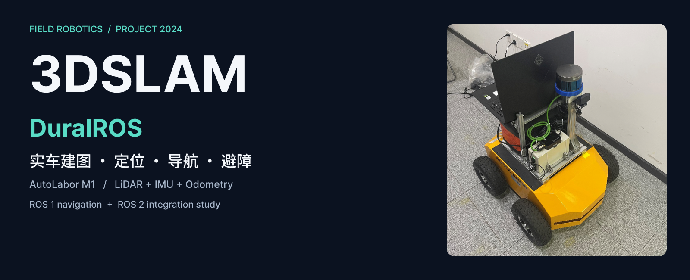
</p>

<h1 align="center">3DSLAM-DuralROS</h1>

<p align="center">
  <strong>从环境建图，到实车自主导航。</strong><br>
  LiDAR SLAM · Localization · Autonomous navigation
</p>

<p align="center">
  <a href="https://github.com/JACKSKYHADES0910"><strong>Jack GU</strong></a> · 项目作者<br>
  <strong>Fred LUO</strong> · 技术支持与项目参与
</p>

<p align="center">
  <a href="#environment"></a>
  <a href="#dual-ros"></a>
  <a href="#hardware"></a>
  <a href="LICENSE"></a>
</p>

<p align="center"><strong>🎬 完整项目演示 · 05:35</strong></p>

https://github.com/user-attachments/assets/183c8e36-d6cf-413a-a5fd-3159e0e1e749

<p align="center">
  <a href="https://www.bilibili.com/video/BV1hQTqzZEsc/?t=284"><strong>▶ Bilibili 完整中文视频 · 从 04:44 实车导航开始</strong></a>
</p>

<p align="center">
  <a href="#contents">目录</a> ·
  <a href="#demo">演示预览</a> ·
  <a href="#architecture">系统架构</a> ·
  <a href="#environment">部署教程</a> ·
  <a href="#field-mapping">实车建图</a> ·
  <a href="#navigation">自主导航</a> ·
  <a href="#future">后续方向</a>
</p>

---

<a id="contents"></a>
## 📖 目录

<details>
<summary><strong>展开完整目录：从演示预览，到实车部署与进阶研究</strong></summary>

1. [项目概览](#overview)
2. [仿真与实车演示](#demo)
3. [实验平台](#hardware)
4. [系统架构与真实运行图](#architecture)
5. [环境与驱动准备](#environment)
6. [Autoware 与 AWSIM 联合仿真](#awsim)
7. [建图方案：原理、对比与选择](#mapping)
8. [工作空间、传感器与 TF](#start)
9. [实车建图与地图保存](#field-mapping)
10. [地图加载与实车定位](#localization)
11. [实车导航与视觉检测](#navigation)
12. [工程问题与排查经验](#lessons)
13. [后续方向](#future)
14. [实现状态与源码](#status)
15. [团队与致谢](#credits)

</details>

**阅读路线：** 先看[演示](#demo)与[架构](#architecture)了解项目；准备复现，从[环境配置](#environment)进入[工作空间](#start)，再依次建图、定位和导航；进阶内容见[建图方案](#mapping)与[后续方向](#future)。

---

<a id="overview"></a>
## 🎯 01 · 项目概览

**基于 AutoLabor M1 的实车建图、定位与导航系统。** 激光雷达、惯性传感器（IMU）和轮式里程计提供环境与运动数据；Cartographer 完成同步定位与建图（SLAM），move_base 通过 Dijkstra 规划全局路径、TEB 调整局部轨迹，最终输出底盘速度指令。

项目还包含 Kinect/YOLOv5 视觉检测实验、ROS1/ROS2 通信探索，以及 Autoware × AWSIM 联合仿真。

| 能力 | 输入 → 结果 | 入口 |
| :-- | :-- | :-- |
| **仿真** | 虚拟道路 → 传感器与规划 → 车辆响应 | [联合仿真](#awsim) |
| **建图** | 点云 + IMU + 里程计 → 地图与状态文件 | [方案比较](#mapping) · [实车建图](#field-mapping) |
| **定位与导航** | 已有地图 + 导航目标 → 路径与速度指令 | [定位](#localization) · [导航](#navigation) |
| **视觉检测** | RGB 图像 → 目标类别与检测框 | [检测与规划接口](#vision) |

> 实车演示完成于 2024 年，中文视频于 2025 年公开。当前源码以 ROS1 实车链路为主；视觉到规划的完整接口和 ROS2 实车工作空间尚未收录。详见[实现状态](#status)。

<a id="demo"></a>
## 🎬 02 · 仿真与实车演示

以下片段按原速循环播放。点击动图，进入原视频对应演示。

### 仿真 · Autoware × AWSIM

[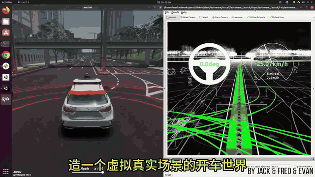](https://www.bilibili.com/video/BV1hQTqzZEsc/?t=70)

**01:10–01:46 · 36 秒。** 左侧是虚拟道路与车辆，右侧是 RViz 中的点云和规划路线，可对照观察规划与行驶响应。

### 建图 · 校园实车

[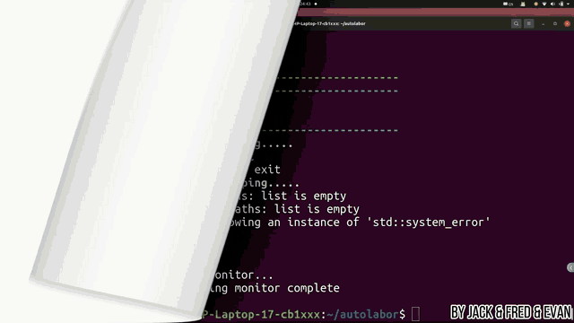](https://www.bilibili.com/video/BV1hQTqzZEsc/?t=166)

**02:46–03:22 · 36 秒。** 从车辆开始移动、点云持续更新处播放。相机画面用于场景对照；Cartographer 的输入为激光雷达、IMU 和轮式里程计。

### 导航 · 目标行驶与局部避障

[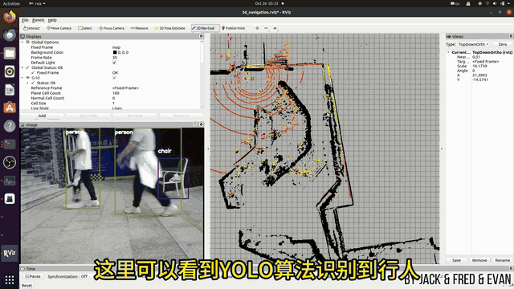](https://www.bilibili.com/video/BV1hQTqzZEsc/?t=284)

**04:36–05:16 · 40 秒。** 对照全局路径、局部轨迹与图像检测框，观察实车导航过程。点击后从 **04:44 车辆起步**处播放。[检测与规划的接口说明](#vision)

[▶ 观看原视频与声音 · 从实车导航开始](https://www.bilibili.com/video/BV1hQTqzZEsc/?t=284)

<a id="hardware"></a>
## 🤖 03 · 实验平台

| 部件 | 配置 | 作用 |
| :-- | :-- | :-- |
| 移动底盘 | **AutoLabor M1** | 差速行驶与轮式里程计 |
| 激光雷达 | **RoboSense RS-LiDAR-16** | 环境点云、建图与障碍观测 |
| IMU | **CH104M**；早期使用 AH100B | 角速度、加速度与姿态 |
| 深度相机 | **Microsoft Kinect v2** | RGB/深度图像与视觉检测 |
| 上位机 | **HP OMEN · Intel i7-10750H** | 运行 ROS 与相关算法 |
| GPU | 原配置记录为 **RTX-2070Ti**，型号待原机核实 | 图像计算 |
| 软件环境 | **Ubuntu 20.04 / ROS Noetic / ROS2 Galactic** | 原开发环境 |

<table>
<tr>
<td width="50%" align="center">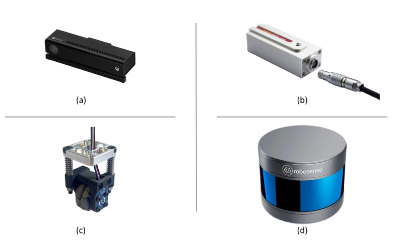</td>
<td width="50%" align="center">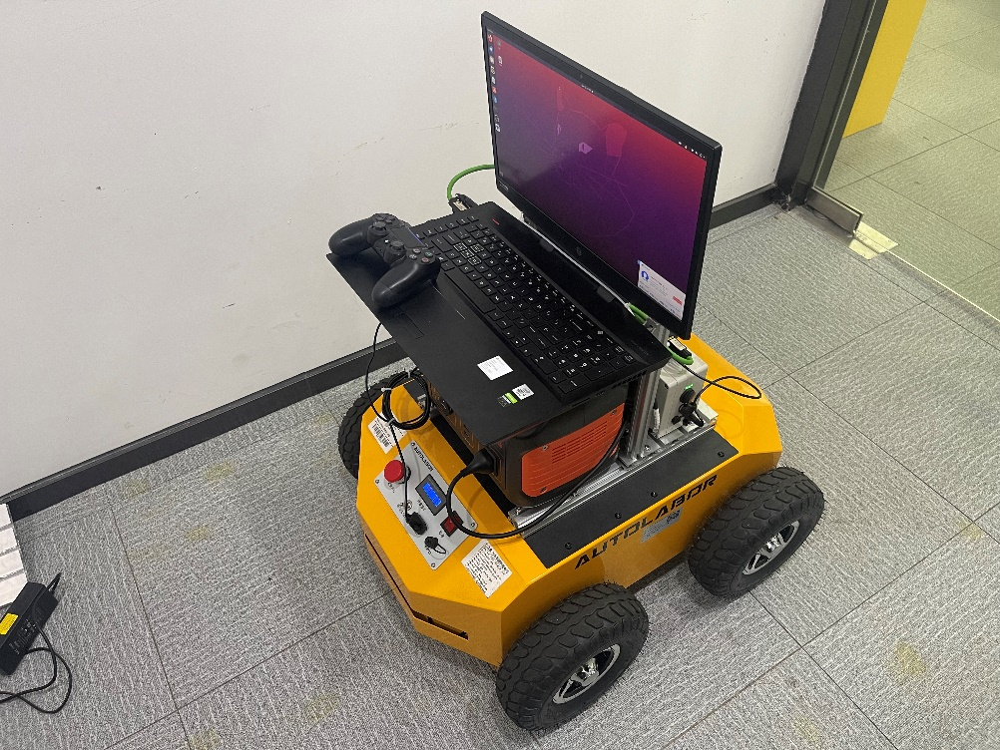</td>
</tr>
<tr>
<td><strong>传感器组合</strong><br><strong>A · 相机：</strong>采集图像与深度。<br><strong>B · IMU：</strong>测量角速度、加速度与姿态。<br><strong>C · 编码器：</strong>测量轮转动，计算里程计。<br><strong>D · 激光雷达：</strong>采集三维点云。</td>
<td><strong>实车装配</strong><br>底盘、传感器、上位机、供电与线缆组成移动平台。驱动包名 <code>autolabor_pro1_driver</code> 与 M1 配置同时存在，实车型号以硬件和配置为准。</td>
</tr>
</table>

<details>
<summary><strong>硬件资料与环境版本</strong></summary>

| 部件 | 资料 |
| :-- | :-- |
| 底盘 | [AutoLabor M1 手册](http://www.autolabor.com.cn/usedoc/m1/navigationKit/receivingGuide/inspection) |
| 激光雷达 | [RS16 原驱动](https://gitee.com/xiaoxinslam/ros_rslidar) · [RoboSense rslidar_sdk](https://github.com/RoboSense-LiDAR/rslidar_sdk) |
| IMU | [HIPNUC / CH104M](https://github.com/hipnuc/products/tree/master) |
| 相机 | [Kinect v2](https://learn.microsoft.com/en-us/windows/apps/design/devices/kinect-for-windows) |
| 上位机 | [HP OMEN](https://www.omen.com/cn/zh/laptops.html) |

[视频简介](https://www.bilibili.com/video/BV1hQTqzZEsc/?t=284)记录了 **Ubuntu 18.04 / ROS Melodic 实车**与 **Ubuntu 20.04 仿真**，仓库记录为 **Ubuntu 20.04 / Noetic / Galactic**。它们对应不同部署阶段，复现时需锁定同一阶段的系统、驱动与参数。Noetic 属于 ROS1，Galactic 属于 ROS2。

</details>

<a id="architecture"></a>
## 🧩 04 · 系统架构与真实运行图

### 从传感器到车辆运动

[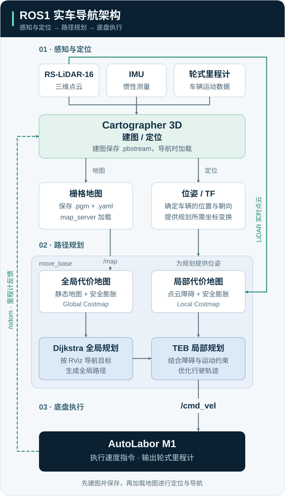](docs/assets/ros1-navigation-architecture.svg)

**建图阶段保存地图，导航阶段加载地图。** Cartographer 3D 负责建图与定位；导航使用二维栅格地图和代价地图（Costmap）。全局规划确定整体路线，局部规划结合实时障碍调整轨迹。

| 数据流 | 作用 | 配置 |
| :-- | :-- | :-- |
| 静态地图 → 全局代价地图 → Dijkstra | 规划到目标的整体路线 | [全局地图配置](src/launch/autolabor_navigation_launch/params/navigation/costmap/3d_global_costmap_params.yaml) |
| 实时点云 → 局部代价地图 → TEB | 结合障碍与运动约束调整轨迹 | [局部地图配置](src/launch/autolabor_navigation_launch/params/navigation/costmap/3d_local_costmap_params.yaml) |
| RViz 初始位姿 → Cartographer | 为已有地图提供定位起点 | [初始化工具](src/tool/cartographer_initialpose/src/cartographer_initialpose.cpp) |

`campus.yaml` 的 `0.05 m/cell` 表示每个栅格边长 5 cm，是地图分辨率。

### 实车 ROS 节点与话题

[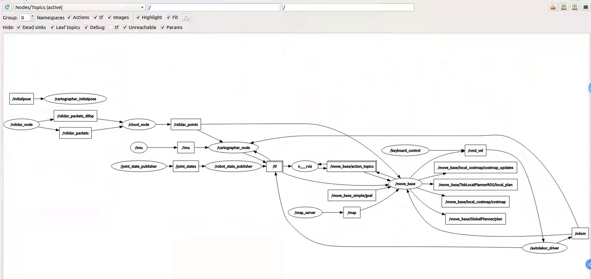](docs/assets/ros-node-graph.png)

按三条路径阅读，点击图片可放大：

| 路径 | 关键节点与话题 |
| :-- | :-- |
| **感知 → 定位** | `/rslidar_points`、`/imu` → `cartographer_node` → `/tf` |
| **地图与目标 → 规划** | `/map`、`/tf`、`/move_base_simple/goal` → `move_base` |
| **规划 → 底盘 → 反馈** | `/cmd_vel` → 底盘 → `/odom`；`/initialpose` → `cartographer_initialpose` 提供定位起点 |

<details>
<summary><strong>AutoLabor 3D SLAM 架构图</strong></summary>

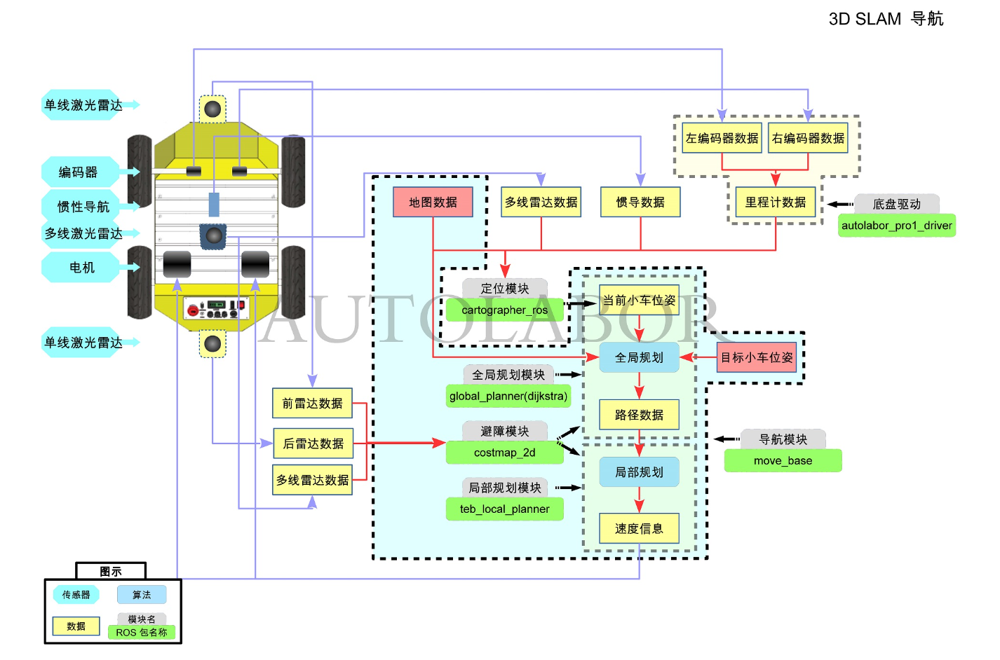

AutoLabor 的通用架构示意，保留原水印；实车传感器与连接方式以本仓库配置为准。

</details>

<a id="dual-ros"></a>
### ROS1 实车与 ROS2 集成

| 路径 | 用途 | 仓库内容 |
| :-- | :-- | :-- |
| **ROS1 实车** | 建图、定位、导航与底盘控制 | 源码、启动文件、参数和地图 |
| **ROS1 ↔ ROS2** | 通过 `ros1_bridge` 交换消息 | 集成记录，完整桥接工作空间待补齐 |
| **Autoware × AWSIM** | 虚拟道路中的自动驾驶仿真 | [部署步骤](#awsim)与演示 |

“DuralROS” 沿用项目名称。桥接时需统一消息类型、坐标、时间戳及服务质量（QoS），再适配车辆控制接口；系统版本约束见 [ros1_bridge 兼容说明](https://github.com/ros2/ros1_bridge#supported-ros-and-ubuntu-versions)。


<a id="environment"></a>
## 📦 05 · 环境与驱动准备

实车环境采用 **Ubuntu 20.04 / ROS1 Noetic**，ROS2 集成记录使用 Galactic。以下步骤用于恢复项目环境；仿真依赖见[下一节](#awsim)。

> Noetic 和 Galactic 均已结束官方支持。新环境应结合驱动与依赖选择受支持的 ROS2 版本；GPU 型号、CUDA 和 TensorRT 兼容性以实际设备为准。[ROS1 支持说明](https://www.ros.org/blog/noetic-eol/) · [ROS2 发布周期](https://github.com/ros2/ros2_documentation/blob/rolling/source/Releases.rst)

| 资料 | 用途 |
| :-- | :-- |
| [AutoLabor M1 手册](http://www.autolabor.com.cn/usedoc/m1/navigationKit/receivingGuide/inspection) | 底盘检查、接线与操作 |
| [AutoLabor 下载](http://www.autolabor.com.cn/download) | 与系统对应的底盘软件 |
| [RS-LiDAR 驱动](https://gitee.com/xiaoxinslam/ros_rslidar) | 项目使用的驱动入口 |
| [RoboSense rslidar_sdk](https://github.com/RoboSense-LiDAR/rslidar_sdk) | 上游驱动与传感器配置 |
| [HIPNUC 产品仓库](https://github.com/hipnuc/products/tree/master) | CH104M 等惯导资料 |
| [Kinect for Windows](https://learn.microsoft.com/en-us/windows/apps/design/devices/kinect-for-windows) | 相机资料；Ubuntu 驱动见仓库 `iai_kinect2-master` |
| [HP OMEN](https://www.omen.com/cn/zh/laptops.html) | 上位机产品资料 |

<details>
<summary><strong>展开部署补充：系统分区、厂商软件与安装工具</strong></summary>

### 系统分区与厂商软件

项目使用 Windows 10 + Ubuntu 20.04 双系统，安装可参考 [HP OMEN 双系统笔记](https://blog.csdn.net/Robert_Q/article/details/115842915)。原机分区为 `/` 250 GB、`/boot` 10 GB、swap 32 GB、EFI 1 GB、`/home` 约 707 GB；容量按实际磁盘调整。

底盘软件可从官方获取，或从厂商系统备份 `catkin_ws` 后迁移。迁移后重新编译，并核对绝对路径、`cmd_vel`、串口和传感器参数。

[厂商下载页](http://www.autolabor.com.cn/download?hmsr=gwstastics&hmpl=os&hmcu=24.04)曾将镜像标为 **“AutolaborOS-24.04-amd64.iso (Ubuntu18.04 ROS Melodic)”**，文件名与版本说明不一致，下载时以发行说明为准。Melodic 的构建产物不能直接用于 Noetic。

项目使用过 FishROS 安装工具：[安装说明](https://fishros.org.cn/forum/topic/20/%E5%B0%8F%E9%B1%BC%E7%9A%84%E4%B8%80%E9%94%AE%E5%AE%89%E8%A3%85%E7%B3%BB%E5%88%97) · [源码](https://github.com/fishros/install)。执行前查看脚本并确认系统与 ROS 版本：

```bash
wget http://fishros.com/install -O fishros && . fishros
```

</details>

<a id="awsim"></a>
## 🖥️ 06 · Autoware 与 AWSIM 联合仿真

本节是独立的仿真路线，使用 **AWSIM v1.0.1 与配套 Autoware**。GPU 驱动、CUDA、TensorRT、cuDNN 和 ROS 版本按[对应官方教程](https://github.com/tier4/AWSIM/blob/v1.0.1/docs/GettingStarted/QuickStartDemo/index.md)配置。

相关资料：[Autoware.AI](https://github.com/autowarefoundation/autoware_ai) · [Autoware.universe](https://github.com/autowarefoundation/autoware.universe) · [早期安装笔记](https://blog.csdn.net/zardforever123/article/details/132528899)。安装以所选版本的官方文档为准。

<details>
<summary><strong>展开联合仿真部署：DDS、地图与启动步骤</strong></summary>

### 6.1 DDS 与依赖

先在独立终端设置环境；验证后可写入 `~/.bashrc`：

```bash
export ROS_LOCALHOST_ONLY=1
export RMW_IMPLEMENTATION=rmw_cyclonedds_cpp

if [ ! -e /tmp/cycloneDDS_configured ]; then
    sudo sysctl -w net.core.rmem_max=2147483647
    sudo ip link set lo multicast on
    touch /tmp/cycloneDDS_configured
fi

sudo apt update
sudo apt install libvulkan1 unzip
```

`ROS_LOCALHOST_ONLY=1` 对应同机仿真场景，多机通信不要照搬。

### 6.2 程序、权限与地图

下载 [AWSIM_v1.0.1.zip](https://github.com/tier4/AWSIM/releases/download/v1.0.1/AWSIM_v1.0.1.zip) 与配套的 [nishishinjuku_autoware_map.zip](https://github.com/tier4/AWSIM/releases/download/v1.0.0/nishishinjuku_autoware_map.zip)。

```bash
cd ~/Downloads
unzip AWSIM_v1.0.1.zip
unzip nishishinjuku_autoware_map.zip

# 替换为解压后的模拟器目录
cd /path/to/AWSIM
chmod +x AWSIM.x86_64
./AWSIM.x86_64
```

记录地图解压目录，供下一步的 `map_path` 使用。

### 6.3 配套 Autoware

在另一个设置相同 DDS 环境的终端中运行：

```bash
cd ~/autoware_universe
source install/setup.bash
ros2 topic list
ros2 launch autoware_launch e2e_simulator.launch.xml \
  vehicle_model:=sample_vehicle \
  sensor_model:=awsim_sensor_kit \
  map_path:=/absolute/path/to/nishishinjuku_autoware_map
```

确认传感器与地图对齐、规划路线正确、模拟车辆按指令响应。新环境请从 [Autoware 官方文档](https://autowarefoundation.github.io/autoware-documentation/main/)选择配套版本。

</details>

<details>
<summary><b>AWSIM 权限设置与联合启动截图</b></summary>


图片来源：[AWSIM v1.0.1 教程](https://github.com/tier4/AWSIM/blob/v1.0.1/docs/GettingStarted/QuickStartDemo/index.md)。

</details>

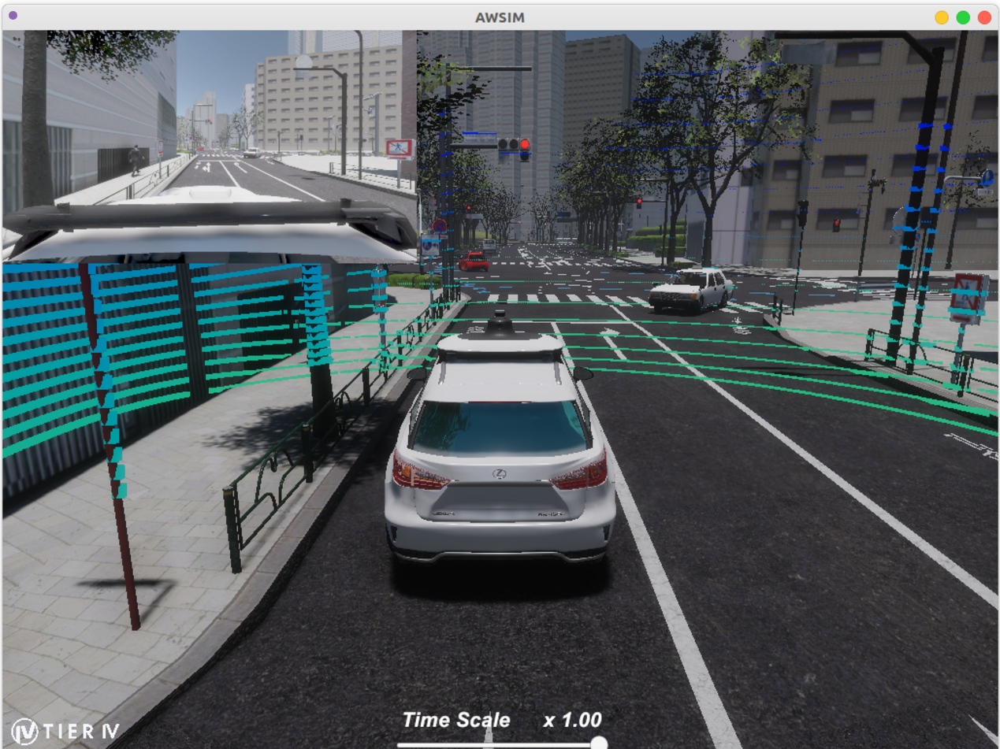

<a id="mapping"></a>
## 🧪 07 · 建图方案：原理、对比与选择

团队比较了 **LeGO-LOAM、NDT Mapping、Cartographer（有/无轮式里程计）**，最终采用带里程计的 Cartographer。以下从地图效果、算法原理和配置要求说明选择。

<table>
<tr>
<td width="33%">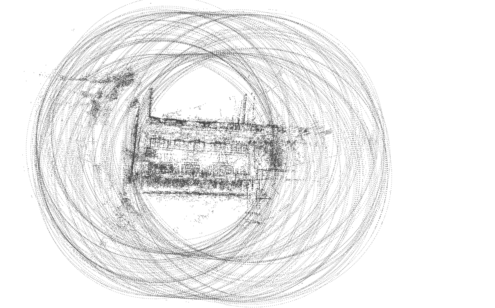</td>
<td width="33%">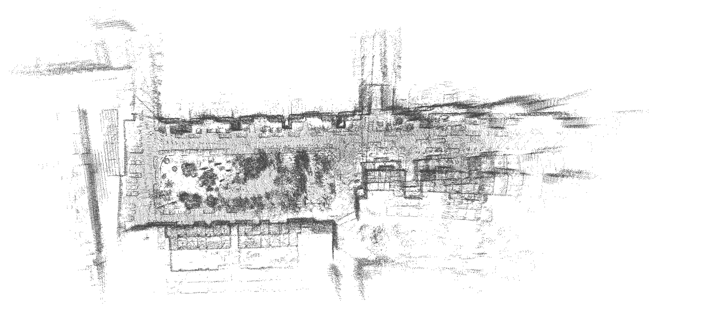</td>
<td width="34%">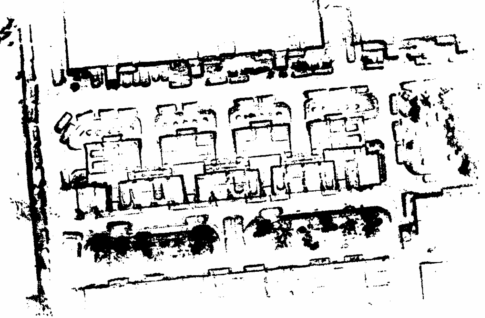</td>
</tr>
<tr>
<td><b>NDT Mapping</b><br>花园场景的点云地图。</td>
<td><b>LeGO-LOAM</b><br>地面车辆的点云建图。</td>
<td><b>Cartographer + Odometry</b><br>项目采用的建图方案。</td>
</tr>
</table>

三张图来自不同试验，展示各方案的输出效果；定量比较需要使用相同数据、参数条件与测量基准。

**算法架构：从传感器输入到地图输出**

[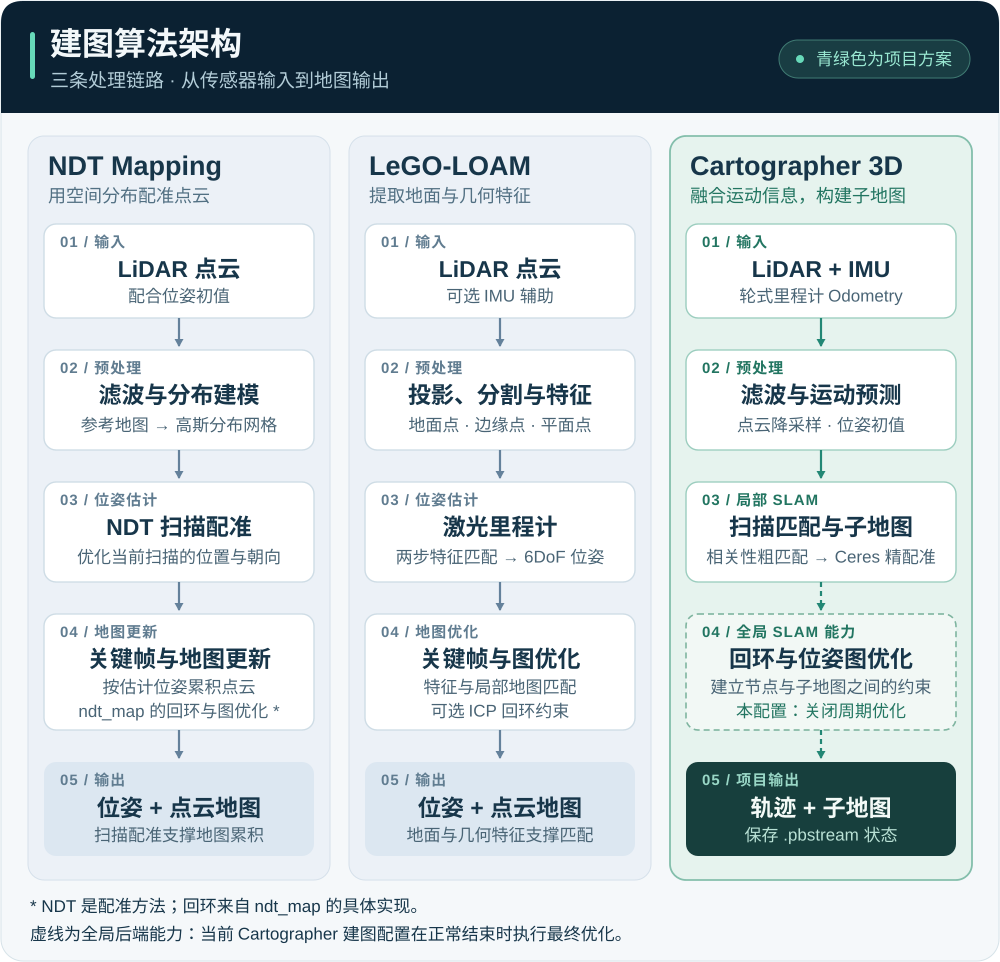](docs/assets/mapping-algorithms.svg)

三列分别对应上方的建图方案，按箭头从上往下阅读；点击图片可放大。[流程依据](docs/EVIDENCE.md#mapping-algorithms)

### 7.1 方案对比

| 比较维度 | LeGO-LOAM | NDT Mapping / ndt_map | Cartographer |
| :-- | :-- | :-- | :-- |
| **坐标接入** | 核对点云轴向、TF 与外参 | 与 ROS/Autoware 接口对齐 frame、单位和外参 | 统一 map/odom/base_link/传感器坐标系 |
| **实时性** | 地面分割和特征处理降低运算量，仍取决于输入与参数 | 本项目观察到较高 CPU 占用；具体实现与分辨率影响明显 | 前端与后端分工；线程、采样与优化频率影响延迟 |
| **精度** | 需结合地面假设、特征、运动与标定验证 | 配准初值、网格分辨率、运动畸变和噪声均会影响结果 | 轮式里程计辅助约束，团队观察到地图更连续；没有统一数值排名 |
| **回环检测** | 上游包含基础 ICP 回环，漂移过大时有限制 | NDT 本身是配准方法；原链接 ndt_map 另实现了基于里程计的回环 | 通过节点与子地图约束进行回环和位姿图优化 |
| **环境适用性** | 适合能可靠提取地面与几何特征的地面机器人场景 | 可用于几何配准与地图构建；动态物体仍需独立处理 | 可用于室内外 2D/3D SLAM，依赖传感器质量与场景约束 |
| **硬件需求** | 关注点云规格与 CPU 负载 | CPU/GPU 取决于所选库，GPU 不是 NDT 的必需条件 | 关注 IMU、点云、内存与后端计算开销 |
| **安装配置** | ROS/catkin、GTSAM、Eigen/PCL 及传感器参数 | ROS/catkin、NDT 库、GTSAM、点云/里程计/IMU 接口 | Cartographer/ROS 接口、Ceres 等依赖、Lua 配置与 TF |

<details>
<summary><strong>展开 LeGO-LOAM：原理、传感器适配与构建</strong></summary>

### 7.2 LeGO-LOAM：地面优化与 6DoF 位姿

LeGO-LOAM 面向地面车辆，利用地面与几何特征估计六自由度位姿（6DoF）。它将里程计与建图分开处理，通过曲率等特征选取边缘点、平面点，减少计算量；上游包含基础 **ICP 回环检测**。

原项目关注静态/平坦场地的高效建图。接入 RS16 时，重点是线束、点云投影、地面提取和 IMU/LiDAR 对齐，不能仅改变话题名称。[LeGO-LOAM 官方源码与说明](https://github.com/RobustFieldAutonomyLab/LeGO-LOAM)

使用独立 catkin 工作空间构建。上游测试环境包含 Indigo/Kinetic/Melodic，Noetic 适配需另行验证。

```bash
# 先按上游所选版本配置 ROS、GTSAM、Eigen/PCL 等依赖
mkdir -p ~/lego_ws/src
cd ~/lego_ws/src
git clone https://github.com/RobustFieldAutonomyLab/LeGO-LOAM.git
cd ~/lego_ws
rosdep install --from-paths src --ignore-src -r -y
catkin_make -j1
source devel/setup.bash
# 完成传感器/TF/时间参数适配后再启动
roslaunch lego_loam run.launch
```

</details>

<details>
<summary><strong>展开 NDT：配准原理、依赖与构建</strong></summary>

### 7.3 NDT：用栅格内的统计分布配准

正态分布变换（Normal Distributions Transform，NDT）将参考点云划分为空间网格，用均值和协方差描述每格的几何分布，再求解新扫描的位姿。配准初值、网格尺度与运动畸变都会影响结果，动态点仍需单独处理。[PCL 官方教程](https://pointclouds.org/documentation/tutorials/normal_distributions_transform.html)

项目参考的 [jyakaranda/ndt_map](https://github.com/jyakaranda/ndt_map) 集成了基于里程计的回环，依赖 GTSAM、ndt_cpu、ndt_gpu 等组件；具体实验使用的提交尚未锁定。

```bash
# 在独立 catkin 工作空间中准备源码
mkdir -p ~/ndt_ws/src
cd ~/ndt_ws/src
git clone https://github.com/jyakaranda/ndt_map.git
cd ~/ndt_ws

# 先补齐所选版本的 GTSAM / ndt_cpu / ndt_gpu 等依赖
rosdep install --from-paths src --ignore-src -r -y
catkin_make
source devel/setup.bash
# 按上游适配点云、Odometry、IMU 和 TF 后再运行
roslaunch ndt_map test.launch
```

</details>

### 7.4 Cartographer：局部子地图与全局图优化

Cartographer 支持 **2D/3D** 建图与定位。局部前端进行扫描匹配并形成子地图；全局后端寻找扫描与子地图之间的约束，将局部结果放到一致的位姿图中。LiDAR 描述环境几何，IMU 帮助估计姿态和重力方向，轮式里程计提供运动信息。回环约束有助于降低累积漂移，其效果仍依赖可观测的环境与正确的数据。[算法说明](https://google-cartographer-ros.readthedocs.io/en/latest/algo_walkthrough.html)

校园试验中，轮式里程计改善了地图连续性与定位稳定性；Cartographer 也便于接入现有驱动、ROS Navigation 和地图复用流程。

<details>
<summary><strong>展开 Cartographer 上游独立构建步骤</strong></summary>

**独立构建上游版本：**

```bash
sudo apt-get update
sudo apt-get install -y python3-wstool python3-rosdep ninja-build
mkdir -p ~/cartographer_ws/src
cd ~/cartographer_ws
wstool init src
wstool merge -t src https://raw.githubusercontent.com/cartographer-project/cartographer_ros/master/cartographer_ros.rosinstall
wstool update -t src
rosdep update
rosdep install --from-paths src --ignore-src --rosdistro="${ROS_DISTRO}" -y
catkin_make_isolated --install --use-ninja
```

核对 Eigen、PCL、Ceres 等依赖版本。恢复本项目时，应保留定制代码与 Lua 参数，按[下一节](#build)构建整个工作空间。[Cartographer 上游](https://github.com/cartographer-project/cartographer)

</details>

### 7.5 怎样选择

- **关注实时性与地图连续性：** 可以从本项目的 Cartographer + Odometry 基线开始，测量前端延迟和后端优化开销。
- **主要在可观察地面的场地行驶：** LeGO-LOAM 是值得比较的路线，先确认点云投影和地面分割适配。
- **研究 NDT/Autoware 配准或复杂动态环境：** 先锁定具体实现，明确初值、动态点处理与回环模块，再用同一记录比较。

<a id="start"></a>
## ⚙️ 08 · 工作空间、传感器与 TF

```bash
git clone https://github.com/JACKSKYHADES0910/3DSLAM-DuralROS.git
cd 3DSLAM-DuralROS
```

<a id="preflight"></a>
### 8.1 补齐依赖与本机配置

编译前，先处理仓库中的依赖和设备配置：

| 检查点 | 当前记录 | 处理方向 |
| :-- | :-- | :-- |
| 子仓库 | 有 8 个 gitlink，根目录缺少 `.gitmodules` | 补齐下载地址与对应提交；仅 `--recursive` 不能恢复缺失映射 |
| LiDAR 驱动 | `src/driver/lidar/rslidar_sdk` 是 gitlink | 恢复原驱动版本，确认 RS16 配置与 `/rslidar_points` |
| LiDAR 配置 | 活动节点的 `config_path` 为空 | 指向本机真实 YAML |
| 底盘串口 | `/dev/ttyUSB_custom0 ` 有尾随空格 | 改为真实设备路径，检查 udev 与权限 |
| 雷达型号 | `lidar3d` 写作 `rs16 ` | 核对 xacro 条件与型号，处理尾随空格 |
| IMU | `/dev/ttyUSB_custom1` | 核对设备、波特率、安装方向与话题 |
| 地图 | 默认 `campus.pbstream` 与 `campus.yaml` | 使用同一次建图生成的配套文件 |
| 构建产物 | 包含原机 build/devel/install 目录 | 在新的工作空间编译 |

定位文件：[底层启动](src/launch/autolabor_navigation_launch/launch/real_environment/third_generation_base.launch) · [导航入口](src/launch/autolabor_navigation_launch/launch/real_environment/third_generation_navigation_3d.launch)。

<a id="build"></a>
### 8.2 从源码重新构建

补齐依赖后，在新工作空间中编译，避免旧缓存和原机绝对路径干扰。以下流程需在目标设备验证。

```bash
# Ubuntu 20.04 + 已安装的 ROS Noetic
source /opt/ros/noetic/setup.bash
sudo apt update
sudo apt install python3-rosdep ninja-build

# 仅在 rosdep 尚未初始化时执行 sudo rosdep init
rosdep update

# 将占位路径替换为真实克隆目录，目标应是新的工作空间
mkdir -p ~/3dslam_ws/src
cp -a /path/to/3DSLAM-DuralROS/src/. ~/3dslam_ws/src/
cd ~/3dslam_ws

# 此前需恢复上节指出的 gitlink 依赖
rosdep install --from-paths src --ignore-src --rosdistro noetic -r -y
catkin_make_isolated --use-ninja
source devel_isolated/setup.bash
```

编译成功后加载 `devel_isolated`。部分包缺少完整安装规则，单独加载 `install_isolated` 会遗漏启动文件、参数或节点。

<a id="sensors"></a>
### 8.3 检查传感器、时间与坐标

完成配置检查后，先启动底层硬件。建图/导航入口也会包含该文件，避免重复启动同名节点。

```bash
roslaunch autolabor_navigation_launch third_generation_base.launch

# 在另一个已 source 同一工作空间的终端检查
rostopic list
rostopic hz /rslidar_points
rostopic hz /odom
rostopic echo -n 1 /odom
rosrun tf tf_echo base_link imu_link
```

点云应有正确 `frame_id` 与递增时间戳。IMU 话题名以驱动输出为准，检查角速度、线加速度、姿态和单位；里程计方向应与实际运动一致。配置使用 `map`、`odom`、`base_link`、`imu_link`，TF 树应连续，并避免重复发布同一变换。

第三代建图配置为 `use_odometry = true`、`num_point_clouds = 1`、`num_laser_scans = 0`、`tracking_frame = "imu_link"`，启用 3D trajectory builder；`points2` 重映射到 `rslidar_points`。

Kinect 提供 RGB/深度图像，用于视觉检测实验；当前 Cartographer 配置不接入相机观测。

运行算法前，逐项确认输入：

| 数据 | 可观察的检查 | 与后续算法的关系 |
| :-- | :-- | :-- |
| LiDAR | 点云频率、frame_id、时间戳、近远处结构 | 影响扫描匹配与障碍观测 |
| IMU | 四元数、角速度、线加速度是否随运动合理变化 | 影响姿态估计与初始化 |
| Odometry | 前进/转弯方向、位移尺度、轮径和轮距 | 影响运动预测与轮滑误差 |
| Kinect | RGB/深度画面、对应关系与标定 | 影响检测和后续几何关联 |

TF 描述传感器之间的位置关系，时间戳记录观测时刻；两者一致，才能正确融合数据。

<a id="field-mapping"></a>
## 🗺️ 09 · 实车建图与地图保存

底层数据正常后，停止单独运行的底层 launch，启动包含驱动的建图入口：

```bash
roslaunch autolabor_navigation_launch third_generation_cartographer_3d.launch
```

确认 RViz 中点云、TF、轨迹与栅格随运动变化。使用经过校准的底盘控制稳定采集，回到已访问区域观察闭环约束与地图一致性。地图精度还需要场地测量与记录支撑，不能仅凭视觉判断。

`.pbstream` 保存 Cartographer 状态；`.pgm + .yaml` 提供导航使用的栅格地图。

```bash
# 确认活动轨迹 ID
rosservice call /get_trajectory_states "{}"

# 0 仅为示例，替换为上一步返回的活动轨迹 ID
rosservice call /finish_trajectory "{trajectory_id: 0}"

# 路径位于 cartographer_node 所在主机，目录需要预先存在
rosservice call /write_state "{filename: '/absolute/path/campus.pbstream', include_unfinished_submaps: true}"
rosrun map_server map_saver -f /absolute/path/campus
```

检查服务返回状态、文件大小、YAML 的 `image` 路径、分辨率与原点。导航时加载这组配套文件。仓库中的校园地图可以用来观察格式，新的物理场地需要自己的地图。

### 当前主配置的关键参数

```lua
-- 摘自 third_generation_mapping.lua
options.tracking_frame = "imu_link"
options.use_odometry = true
options.num_point_clouds = 1
options.num_laser_scans = 0
MAP_BUILDER.use_trajectory_builder_3d = true
TRAJECTORY_BUILDER_3D.use_online_correlative_scan_matching = true
TRAJECTORY_BUILDER_3D.submaps.num_range_data = 60
MAP_BUILDER.num_background_threads = 4
```

这些值描述当前快照，不是所有硬件的通用最佳值。仓库 occupancy grid 节点还包含 `unknow_as_free` 扩展；换成未包含该改动的上游节点时，不能照搬全部 launch 参数。[自定义源码](src/mapping/cartographer_ros/cartographer_ros/cartographer_ros/occupancy_grid_node_main.cc)


<a id="localization"></a>
## 📍 10 · 地图加载与实车定位

**加载已有地图 → 给出初始位姿 → 持续匹配定位。** 首次运行时，在 RViz 中设置车辆的位置和朝向，并确认 LiDAR、IMU、里程计及 TF 正常。

### 10.1 加载地图状态

导航入口通过命令行参数加载 `.pbstream`：

```xml
<node name="cartographer_node" pkg="cartographer_ros"
      type="cartographer_node"
      args="-configuration_directory $(find autolabor_navigation_launch)/params/cartographer
            -configuration_basename third_generation_location.lua
            -load_state_filename $(find autolabor_navigation_launch)/map/campus.pbstream"
      output="screen">
  <remap from="points2" to="rslidar_points" />
</node>
```

定位配置继承 3D 建图参数，保留 3 个活动子地图，并投影输出供地面导航使用：

```lua
-- third_generation_location.lua
include "third_generation_mapping.lua"
options.publish_frame_projected_to_2d = true
TRAJECTORY_BUILDER.pure_localization_trimmer = {
  max_submaps_to_keep = 3,
}
POSE_GRAPH.optimize_every_n_nodes = 50
```

### 10.2 设置初始位姿

1. 在 RViz 点击 **2D Pose Estimate**，按实车位置和朝向放置箭头。
2. `cartographer_initialpose` 接收 `/initialpose`，结束活动轨迹，通过 `/start_trajectory` 启动带初始位姿的新轨迹。
3. 检查点云与地图是否重合、TF 是否连续，观察移动后位姿是否稳定。

该流程使用 Cartographer 轨迹服务。普通 `initial_pose_x/y/a` 参数不能直接完成初始化；手动设置初始位姿也不能替代传感器标定。[初始化源码](src/tool/cartographer_initialpose/src/cartographer_initialpose.cpp)

| 配置项 | 本项目用法 |
| :-- | :-- |
| 状态文件 | 命令行参数 `-load_state_filename`；与 `.yaml/.pgm` 配套 |
| 传感器输入 | `points2 → rslidar_points`，3D 输入链路需要有效 IMU |
| 时钟 | 实车使用真实时钟；回放和仿真按需设置 `use_sim_time` |
| 地图维护 | 场地显著变化后更新或重建地图 |

<details>
<summary><strong>展开定位调参：参数作用与观察重点</strong></summary>

### 10.3 定位调参

保存同一组传感器记录，每次只调整一项，对比误差、处理延迟和失效恢复：

| 参数 | 作用 | 观察重点 |
| :-- | :-- | :-- |
| `huber_scale` | 鲁棒损失尺度 | 异常约束对优化结果的影响 |
| `optimize_every_n_nodes` | 后端优化频率；当前为 `50` | 位姿修正速度与计算开销 |
| `constraint_builder.min_score` | 局部约束接受门限 | 约束数量与误匹配 |
| `global_localization_min_score` | 全局定位约束门限 | 错误恢复与漏匹配 |

这些参数控制扫描匹配与位姿图优化，不能替代动态障碍处理。具体值应根据传感器和场地验证。[定位配置](src/launch/autolabor_navigation_launch/params/cartographer/third_generation_location.lua)

</details>

<a id="navigation"></a>
## 🧭 11 · 实车导航与视觉检测

### 11.1 启动并设置目标

地图、驱动与传感器配置完成后，停止建图进程，再运行：

```bash
roslaunch autolabor_navigation_launch third_generation_navigation_3d.launch
```

该入口启动驱动、Cartographer 定位、map_server、初始位姿工具、move_base 与 RViz。完成定位后，用 **2D Nav Goal** 设置目标；首次实车测试确认急停与人工接管可用。

### 11.2 从目标到速度指令

**move_base** 接收目标位姿，结合定位和代价地图调用规划器，最终输出 `/cmd_vel`。

| 环节 | 当前配置 | 作用 |
| :-- | :-- | :-- |
| 全局路径 | `global_planner/GlobalPlanner`，`use_dijkstra: true` | Dijkstra 搜索到目标的低代价路线 |
| 局部轨迹 | `teb_local_planner/TebLocalPlannerROS` | 时间弹性带（Timed Elastic Band，TEB）结合障碍、速度和运动约束优化轨迹 |
| 障碍观测 | 局部 costmap 体素层接收 `rslidar_points` | 标记与清除障碍；全局 costmap 使用静态地图与膨胀层 |
| 底盘执行 | `/cmd_vel` → 底盘驱动 | 执行速度指令，并通过里程计反馈运动 |

TEB 配置中的 `max_vel_x: 0.2` 是规划器前进速度上限，单位为 m/s。车体轮廓（footprint）、膨胀范围、串口与底盘限速需匹配实车。

<table>
<tr>
<td width="50%">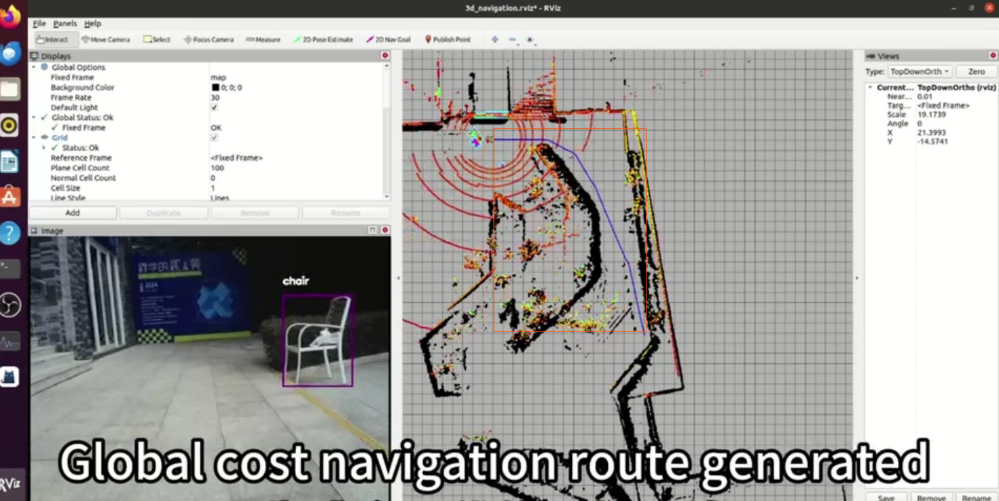</td>
<td width="50%">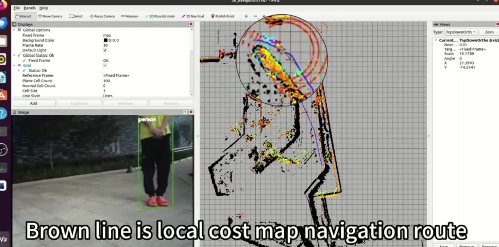</td>
</tr>
<tr>
<td><strong>全局路径</strong><br>从当前位置到目标的整体路线。</td>
<td><strong>局部轨迹</strong><br>结合附近障碍和运动约束调整的短程轨迹。</td>
</tr>
</table>

<a id="vision"></a>
### 11.3 从视觉检测到规划输入

YOLOv5 从 Kinect 图像中预测目标类别、置信度和二维检测框。要让规划器利用检测结果，还需把图像中的目标转换为带位置与运动信息的障碍：

| 环节 | 输出 |
| :-- | :-- |
| 图像检测 | 类别、置信度、像素框与图像时间戳 |
| 深度关联 | 由深度/点云估计目标位置和尺度 |
| 坐标转换 | 将观测转换到规划器使用的坐标系 |
| 连续跟踪 | 关联多帧目标，估计速度与延迟 |
| 规划适配 | 通过 costmap 或障碍消息接口输入规划器 |

视频可观察到检测画面；当前源码可核实的避障链路为 **LiDAR → 局部 costmap → TEB**。各模块的源码收录情况见[实现状态](#status)。

<a id="lessons"></a>
## 🛠️ 12 · 工程问题与排查经验

| 现象 | 实验经验与检查方法 |
| :-- | :-- |
| **初始化困难、位姿漂移** | 曾发现 IMU 四元数及运动读数异常并更换设备；先查原始数据，再核对安装方向、单位、时间戳与 TF |
| **玻璃、水面附近点云异常** | 反射会造成稀疏点云或错误回波；检查原始点云，多帧融合与深度补全需另做验证，并计入处理延迟 |
| **高负载、丢帧** | NDT 试验中出现较高 CPU 占用；同时记录前端处理时间、后端优化、频率与内存 |
| **移动供电下卡顿** | 调整过移动电源与散热；测试时记录供电状态、CPU 频率、温度和延迟 |
| **跨 ROS 版本通信异常** | 消息互通后，继续核对坐标、时间戳、服务质量（QoS）和车辆控制接口 |

**先验证输入，再调整算法。** IMU 更换后仍需重新检查标定与时间同步；定位、建图和避障效果应使用固定路线、重复试验和明确指标评估。[故障速查](#troubleshooting) · [评估计划](#evaluation)

<a id="future"></a>
## 🚀 13 · 后续方向

以下为待验证的研究与工程计划，尚未集成本仓库。详细资料见[路线说明](docs/ROADMAP.md)。

<details>
<summary><strong>展开研究路线：ROS2、传感器融合、动态障碍与仿真</strong></summary>

### 13.1 建立可复现基线

补齐子仓库地址与提交，恢复标定，锁定依赖，保存可回放的传感器记录（rosbag）。使用同一场地和任务测量 **Cartographer + Dijkstra + TEB**，再逐项替换模块，区分算法、标定和数据差异带来的影响。

### 13.2 迁移 ROS2 与驱动

优先验证底盘、RS16 和 IMU 的消息、时钟与 TF，再迁移定位和导航。版本选择取决于驱动及目标软件栈；`ros1_bridge` 可用于过渡，但需核对系统兼容性。[ROS2 发布周期](https://github.com/ros2/ros2_documentation/blob/rolling/source/Releases.rst) · [桥接兼容表](https://github.com/ros2/ros1_bridge#supported-ros-and-ubuntu-versions)

**验证重点：** 传感器频率、通信延迟、TF 一致性，以及速度指令与里程计反馈。

### 13.3 多传感器融合

[FAST-LIVO2](https://github.com/hku-mars/FAST-LIVO2) 是 LiDAR、惯性与视觉融合的候选；激光惯性方案还可对照 [FAST-LIO](https://github.com/hku-mars/FAST_LIO) 和 [LIO-SAM](https://github.com/TixiaoShan/LIO-SAM)。接入前，先核对 RS16 点级时间、IMU 采样、传感器外参和相机同步。

**验证重点：** 相同路线下的漂移、跟踪丢失、恢复时间和运算开销，覆盖走廊、低纹理、轮滑与反射场景。

### 13.4 动态障碍与局部控制

先补齐“二维检测框 → 深度关联 → 坐标转换 → 跟踪 → 规划输入”，再评估检测模型与控制器。ROS2 迁移后，可将 [Nav2 MPPI](https://github.com/ros-navigation/navigation2/tree/main/nav2_mppi_controller) 作为局部控制的对照方案。

**验证重点：** 行人横穿、遮挡后出现、狭窄会车场景中的最小间距、到达率、碰撞/接管次数与控制延迟。

### 13.5 闭环仿真与自动驾驶模型

在 AWSIM/Autoware 中固定地图、任务与随机种子，测试传感器异常、动态交通和失效恢复。[Autoware 文档](https://autowarefoundation.github.io/autoware-documentation/main/) · [AWSIM](https://github.com/tier4/AWSIM)

视觉语言动作模型（Vision-Language-Action，VLA）可作为离线场景分析与仿真对比方向，例如 NVIDIA Alpamayo 与 AlpaSim。接入前核对许可、显存、输入格式和延迟，实车部署需单独验证。[官方技术介绍](https://developer.nvidia.com/blog/building-autonomous-vehicles-that-reason-with-nvidia-alpamayo/)

### 13.6 自动探索与泊车

自动探索可比较边界搜索（Frontier Exploration）与快速随机树（RRT）方法，评估信息增益、重复行驶和频繁停顿。泊车任务可从倒车入位与侧方停车开始，测量最终位置、角度误差和失败恢复能力。

</details>

<a id="evaluation"></a>
### 13.7 实验指标

绝对轨迹误差（ATE）衡量整体轨迹偏差，相对位姿误差（RPE）衡量局部运动偏差。它们需要真值或可靠的测量基准。

| 层级 | 指标 | 必要记录 |
| :-- | :-- | :-- |
| 传感器 | 频率、丢包、时差 | 原始消息、时间源、标定文件 |
| 定位 | ATE/RPE、跟踪丢失、恢复时间 | 基准轨迹、初始化条件、重复试验 |
| 建图 | 一致性、尺度偏差、回环表现 | 相同路线、参数与地图 |
| 导航 | 到达率、时间、路程、接管/碰撞 | 起终点、障碍设置、每次试验结果 |
| 实时性 | 处理延迟分布、CPU/GPU、内存 | 运行日志、硬件与供电状态 |

<a id="status"></a>
## 🗂️ 14 · 实现状态与源码

| 模块 | 已有成果 | 仓库内容 |
| :-- | :-- | :-- |
| Cartographer + LiDAR/IMU/Odometry | 实车建图、地图复用与定位 | 源码、参数、地图和演示 |
| move_base + Dijkstra + TEB | 校园目标导航与避障 | 启动文件、代价地图与规划参数 |
| Kinect + YOLOv5 | 视觉检测演示 | Kinect 驱动；YOLOv5 节点、权重及检测到规划的完整接口待补齐 |
| ROS1/ROS2 bridge | 跨版本通信探索 | 完整桥接工作空间待补齐 |
| Autoware × AWSIM | 联合仿真 | 部署步骤与演示，需使用配套上游版本 |
| 自动探索、动态感知、泊车 | 后续计划 | [研究方向](#future) |

<a id="structure"></a>
<details>
<summary><strong>展开仓库结构与目录用途</strong></summary>

### 仓库结构

```text
3DSLAM-DuralROS/
├── src/
│   ├── driver/        # 底盘、IMU、激光雷达、深度相机
│   ├── mapping/       # Cartographer、GMapping 等
│   ├── navigation/    # move_base、global_planner、TEB、costmap
│   ├── launch/        # 启动文件、参数、地图
│   ├── simulation/    # AutoLabor 仿真与机器人模型
│   └── tool/          # 初始位姿、图像等工具
├── docs/
│   ├── REPRODUCTION.md  # 环境与部署说明
│   ├── ROADMAP.md       # 后续方向与参考资料
│   └── assets/          # 图片、动图与视频
└── README.md
```

仓库还包含旧构建产物；复现时按[构建步骤](#build)在新工作空间编译。

</details>

### 实车入口

| 任务 | 文件 |
| :-- | :-- |
| 底盘、LiDAR、IMU | [third_generation_base.launch](src/launch/autolabor_navigation_launch/launch/real_environment/third_generation_base.launch) |
| 3D 建图 | [third_generation_cartographer_3d.launch](src/launch/autolabor_navigation_launch/launch/real_environment/third_generation_cartographer_3d.launch) |
| 建图参数 | [third_generation_mapping.lua](src/launch/autolabor_navigation_launch/params/cartographer/third_generation_mapping.lua) |
| 定位与导航 | [third_generation_navigation_3d.launch](src/launch/autolabor_navigation_launch/launch/real_environment/third_generation_navigation_3d.launch) |
| 定位参数 | [third_generation_location.lua](src/launch/autolabor_navigation_launch/params/cartographer/third_generation_location.lua) |
| 初始位姿 | [cartographer_initialpose.cpp](src/tool/cartographer_initialpose/src/cartographer_initialpose.cpp) |
| 全局/局部规划 | [Dijkstra](src/launch/autolabor_navigation_launch/params/navigation/global_planer/global_planner_params.yaml) · [TEB](src/launch/autolabor_navigation_launch/params/navigation/local_planer/navigation_teb_local_planner_params.yaml) |

<a id="troubleshooting"></a>
<details>
<summary><strong>故障速查</strong></summary>

| 现象 | 优先检查 |
| :-- | :-- |
| 无点云 | 雷达地址/端口、驱动、`config_path`、话题名、网卡 |
| TF 失败 | 坐标系名称、xacro、安装外参、时间戳、重复发布 |
| 地图弯曲或位姿跳变 | IMU、里程计标定、同步、轮滑、反射 |
| 地图加载后位置错误 | 状态与栅格是否配套、初始位姿、外参 |
| 有全局路径但不走 | 局部轨迹、障碍代价、速度输出、串口、限速、急停 |
| 检测有框但避障无变化 | 深度关联、坐标变换、障碍消息、规划器订阅 |
| 移动供电时卡顿 | 电源能力、CPU 频率、温度、散热、丢帧 |
| ROS2 有话题但不可用 | 消息类型与语义、时间、QoS、外参、车辆接口 |

</details>

<a id="credits"></a>
## 🤝 15 · 团队与致谢

**Jack GU** · 项目作者<br>
**Fred LUO** · 技术支持与项目参与

感谢 AutoLabor、RoboSense、HIPNUC、Cartographer、ROS Navigation、TEB、LeGO-LOAM、YOLOv5、Autoware 和 AWSIM 社区。项目工作包括系统集成、参数配置、实验与实车部署。

**参考项目：** [Cartographer](https://github.com/cartographer-project/cartographer) · [Cartographer ROS](https://google-cartographer-ros.readthedocs.io/en/latest/) · [LeGO-LOAM](https://github.com/RobustFieldAutonomyLab/LeGO-LOAM) · [NDT_MAP](https://github.com/jyakaranda/ndt_map) · [TEB](https://github.com/rst-tu-dortmund/teb_local_planner) · [Autoware](https://github.com/autowarefoundation/autoware.universe) · [AWSIM](https://github.com/tier4/AWSIM/tree/v1.0.1) · [ros1_bridge](https://github.com/ros2/ros1_bridge)

根目录采用 [Apache License 2.0](LICENSE)。第三方代码、软件画面与参考图遵循各自许可及署名要求。

欢迎通过 [Issues](https://github.com/JACKSKYHADES0910/3DSLAM-DuralROS/issues) 交流复现记录，请附系统版本、传感器型号、启动命令与相关日志。

---

<p align="center">
  <strong>从环境建图，到实车自主导航。</strong><br>
  <a href="#3dslam-duralros">回到顶部</a> ·
  <a href="https://www.bilibili.com/video/BV1hQTqzZEsc/?t=284">Bilibili 完整中文视频</a> ·
  <a href="#environment">部署教程</a>
</p>
