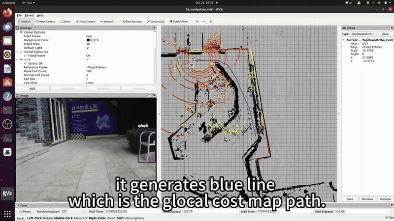
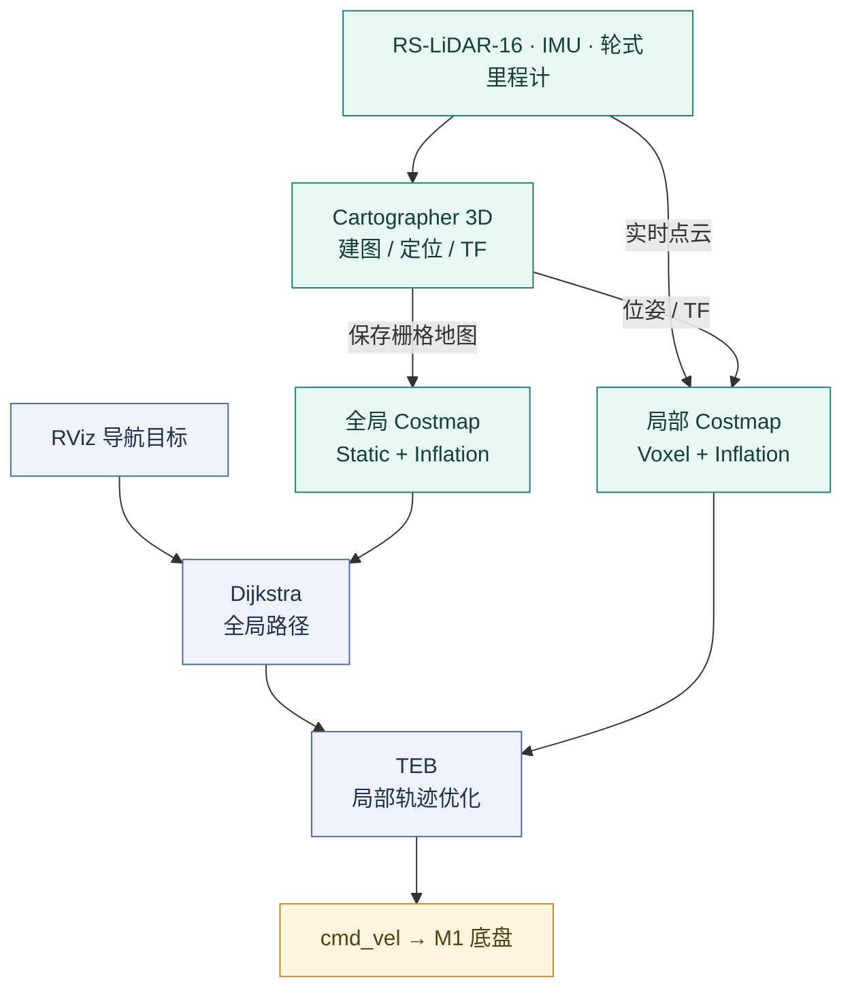

<div align="center">


# 3DSLAM-DuralROS

**把 SLAM、定位和路径规划，接到一台真正行驶的机器人上。**

Field robotics · LiDAR SLAM · Autonomous navigation

[](docs/REPRODUCTION.md) [](#dual-ros) [](#hardware) [](LICENSE)

**[观看实车演示](#demo) · [系统架构](#architecture) · [复现教程](docs/REPRODUCTION.md) · [技术演进](docs/ROADMAP.md) · [原版文档](docs/archive/README.original.md)**

</div>

这是一个以 **AutoLabor M1** 为实验平台的自动驾驶毕业设计：使用 **RS-LiDAR-16、IMU 与轮式里程计**构建环境地图、恢复机器人位姿，再通过 **move_base、Dijkstra 和 TEB**完成目标导航与局部避障。项目同时探索了 **ROS1/ROS2 通信桥接**，以及 **Autoware.universe 与 AWSIM** 联合仿真。

这里既记录系统怎样搭起来，也保留它在校园实车实验中遇到的问题。论文、答辩演示与仓库配置一起构成项目证据；完整源码入口和复现条件见下文。

> **版本说明**：实车工作完成于 2024 年，本页于 2026 年重新整理。公开仓库主要保存 ROS1 工作空间与实验配置；ROS2/Autoware、YOLOv5 的演示记录及源码覆盖范围见 [实现状态](#status)。本次更新聚焦文档与展示素材，未重新进行实车验收。

<a id="demo"></a>
## 01 · 先看机器人怎样工作

[](https://www.youtube.com/watch?v=1bbiSgneRYA)

**[▶ YouTube 完整演示](https://www.youtube.com/watch?v=1bbiSgneRYA)** · **[▶ PPT 内嵌视频副本 · 3 分 18 秒](docs/assets/road-demo.mp4)**

上方动图取自答辩 PPT 第 48 页的视频，展示 RViz 中的路径规划、局部轨迹和相机画面。仓库同时提供完整 MP4，便于下载观看；播放分辨率为 960 × 540，保留原视频音轨。视频中的字幕为历史演示原文。

<table>
  <tr>
    <td width="50%"></td>
    <td width="50%"></td>
  </tr>
  <tr>
    <td><b>环境建图</b><br>Cartographer + Odometry，保留场地结构供后续定位使用。</td>
    <td><b>目标导航</b><br>全局路线连接当前位置与目标，局部规划响应周围障碍。</td>
  </tr>
  <tr>
    <td></td>
    <td></td>
  </tr>
  <tr>
    <td><b>局部避障</b><br>通过代价地图与 TEB 调整机器人附近的运动轨迹。</td>
    <td><b>仿真探索</b><br>AWSIM 提供虚拟环境，连接 Autoware.universe 做联合仿真。</td>
  </tr>
</table>

以上图片均来自项目论文或答辩材料；[素材来源与实验说明](docs/EVIDENCE.md)记录了对应章节、幻灯片及使用边界。

<a id="learn"></a>
## 02 · 这个项目值得看什么

| 项目重点 | 可以学到的东西 | 直接入口 |
| :-- | :-- | :-- |
| **传感器真正接起来** | LiDAR、IMU、编码器的数据、时间戳和 TF 怎样进入同一个系统 | [硬件与校准](docs/REPRODUCTION.md#sensors) |
| **建图方案的取舍** | NDT、LeGO-LOAM 与 Cartographer 的实验观察，以及里程计的作用 | [建图对比](#mapping) |
| **地图跨启动复用** | 保存 `.pbstream`，加载地图，手动给定初始位姿后持续定位 | [定位流程](docs/REPRODUCTION.md#localization) |
| **规划落实为底盘运动** | 全局路线、局部轨迹、costmap 与 `/cmd_vel` 的关系 | [导航流程](docs/REPRODUCTION.md#navigation) |
| **工程问题的处理** | 传感器漂移、反光表面、CPU 负载、供电散热与版本兼容 | [问题与经验](#lessons) |
| **连接新的研究方向** | ROS2 迁移、LiDAR–inertial–visual odometry、闭环仿真如何接续本项目 | [2026 技术路线](docs/ROADMAP.md) |

<a id="architecture"></a>
## 03 · 系统如何闭环

### 实车主链路 · ROS1



**3D 建图与地面导航承担不同的任务。** 本仓库的第三代配置使用 Cartographer 3D 处理点云、IMU 和里程计，导航侧使用二维栅格地图及包含点云观测的代价地图。仓库中 `campus.yaml` 的 **0.05 m/cell 是栅格分辨率**，不代表测量精度。

图中同时呈现建图与导航阶段。当前全局代价地图启用静态地图与膨胀层，Dijkstra 据此规划路线；实时点云进入局部体素层，供 TEB 调整附近的轨迹。[全局配置](src/launch/autolabor_navigation_launch/params/navigation/costmap/3d_global_costmap_params.yaml) · [局部配置](src/launch/autolabor_navigation_launch/params/navigation/costmap/3d_local_costmap_params.yaml)

初始化时，RViz 的 `2D Pose Estimate` 发布 `/initialpose`；仓库内的 `cartographer_initialpose` 将位姿转换为 Cartographer 的轨迹服务请求。之后由扫描匹配和位姿图约束持续估计位置。[查看实际实现](src/tool/cartographer_initialpose/src/cartographer_initialpose.cpp)

<a id="dual-ros"></a>
### 双 ROS 的工程背景

历史硬件驱动主要工作在 ROS1，而 Autoware.universe 使用 ROS2。论文记录了通过 `ros1_bridge` 交换消息的探索；AWSIM 联合仿真则是另一条实验路径。

| 路径 | 当时的目标 | 本仓库提供的内容 |
| :-- | :-- | :-- |
| **ROS1 实车** | 建图、定位、导航与底盘控制 | catkin 源码、launch、Lua/YAML、场地地图 |
| **ROS1 ↔ ROS2** | 连接既有驱动与 ROS2 软件生态 | 论文与 PPT 中的桥接说明；桥接工程需另行配置 |
| **Autoware + AWSIM** | 在虚拟街道运行自动驾驶软件栈 | 历史部署教程与演示截图；上游软件需独立安装 |

这里的 “DuralROS” 延续项目原名。它描述项目跨 ROS 版本的探索；当前源码并不是两份功能完全对等的 ROS1/ROS2 实车发行包。

<a id="hardware"></a>
## 04 · 实验平台

| 部件 | 历史配置 | 在系统中的作用 |
| :-- | :-- | :-- |
| 移动底盘 | **AutoLabor M1** | 差速运动、编码器反馈与轮式里程计 |
| 激光雷达 | **RoboSense RS-LiDAR-16** | 环境点云、建图与障碍观测 |
| 惯性传感器 | **CH104M**；论文也记录了早期 AH100B | 角速度、加速度与姿态信息；以实际接线和 launch 为准 |
| 深度相机 | **Microsoft Kinect v2** | RGB/深度画面与视觉检测实验 |
| 上位机 | **HP OMEN · Intel i7-10750H** | 运行 ROS 与相关计算任务 |
| GPU | 原 README 记为 **RTX-2070Ti** | 保留原记录；准确型号需在原机复核 |
| 历史系统 | **Ubuntu 20.04 / ROS Noetic / ROS2 Galactic** | 复原当年的环境组合 |

驱动名称 `autolabor_pro1_driver` 与底盘配置 `M1` 同时出现在项目中；不要仅凭包名判断实车型号。硬件手册、驱动来源、历史系统分区和安装入口统一整理在[环境准备](docs/REPRODUCTION.md#environment)。

<a id="mapping"></a>
## 05 · 为什么最后选 Cartographer

项目实际比较了 **NDT Mapping、LeGO-LOAM、Cartographer（有/无里程计）**。团队最终使用带轮式里程计的 Cartographer，主要考虑地图连续性、定位稳定性与计算负担的平衡。

| 方案 | 在本项目中的观察 | 复现时应关注 |
| :-- | :-- | :-- |
| **NDT Mapping** | 论文记录了点云噪声与较高 CPU 占用 | 配准分辨率、初值、运动畸变与具体实现；回环能力取决于系统配置 |
| **LeGO-LOAM** | 地面优化与较轻的计算负担有吸引力，接入时出现地图/坐标对齐问题 | 线束排列、外参、TF、坐标约定；上游已有基础 ICP 回环 |
| **Cartographer，无里程计** | 保留了室内建图试验，但材料对其稳定性评价不完全一致 | 场景特征、IMU 数据质量与参数选择 |
| **Cartographer，有里程计** | 团队在花园/校园场地采用的方案 | 时间同步、轮径与轮距标定、轮滑、闭环约束 |

这是**项目经验比较**，没有统一数据集、相同参数和重复试验支撑的算法排行榜。原文的定性表格及描述全部保留在[历史 README](docs/archive/README.original.md)，技术更正与材料差异见[证据说明](docs/EVIDENCE.md#corrections)。

<details>
<summary><b>论文报告的结果与解释范围</b></summary>

论文的 “Validation (or Testing)” 写到平均定位准确率 **95%**、建图误差 **小于 2%**、受控场景避障成功率 **大于 90%**；PPT 第 22 页讲稿写到 **3.35 s** 重定位。

这些数值保留为**历史材料报告值**。现有材料没有给出完整的指标定义、样本量、ground truth、原始日志和可重复计算流程，因此不将它们作为当前版本的独立验证成绩，也不将其换算成厘米级精度。下一轮评估应记录 ATE/RPE、定位恢复时间分布、导航成功率、碰撞/接管次数和 CPU/GPU 延迟。[评估计划](docs/ROADMAP.md#evaluation)

</details>

<a id="start"></a>
## 06 · 怎样开始阅读与复现

**只想了解成果：** 看视频 → 看系统图 → 看算法取舍与工程经验。<br>
**准备接实车：** 检查依赖与硬件 → 校准传感器 → 建图 → 保存地图 → 初始化定位 → 下发导航目标。<br>
**准备继续研究：** 先固化历史基线，再独立评估 ROS2 迁移和新算法。

```bash
git clone https://github.com/JACKSKYHADES0910/3DSLAM-DuralROS.git
cd 3DSLAM-DuralROS
```

主流程的源码入口：

| 任务 | 文件 |
| :-- | :-- |
| 底盘、LiDAR、IMU 启动 | [third_generation_base.launch](src/launch/autolabor_navigation_launch/launch/real_environment/third_generation_base.launch) |
| 3D 建图 | [third_generation_cartographer_3d.launch](src/launch/autolabor_navigation_launch/launch/real_environment/third_generation_cartographer_3d.launch) |
| 建图参数 | [third_generation_mapping.lua](src/launch/autolabor_navigation_launch/params/cartographer/third_generation_mapping.lua) |
| 定位与导航 | [third_generation_navigation_3d.launch](src/launch/autolabor_navigation_launch/launch/real_environment/third_generation_navigation_3d.launch) |
| 纯定位参数 | [third_generation_location.lua](src/launch/autolabor_navigation_launch/params/cartographer/third_generation_location.lua) |
| 全局/局部规划 | [Dijkstra 配置](src/launch/autolabor_navigation_launch/params/navigation/global_planer/global_planner_params.yaml) · [TEB 配置](src/launch/autolabor_navigation_launch/params/navigation/local_planer/navigation_teb_local_planner_params.yaml) |

> **复现前先读这一条：** 历史快照有缺失下载配置的 Git 子仓库引用、空的 LiDAR `config_path`，以及与原机相关的串口/参数。先完成[复现前检查](docs/REPRODUCTION.md#preflight)，再使用教程里的启动命令。本页不会把这些入口包装成已经验证的一键安装。

完整教程：**[环境准备 → 传感器 → 建图 → 地图保存 → 定位 → 导航 → AWSIM](docs/REPRODUCTION.md)**。

<a id="lessons"></a>
## 07 · 真正让系统跑起来的细节

| 遇到的问题 | 项目记录与下一步检查 |
| :-- | :-- |
| **位姿漂移、初始化困难** | 论文记录 IMU 数据异常并更换设备；复现时同时核对四元数、时间戳、安装方向、TF 和角速度/加速度单位 |
| **玻璃、水面与反射** | 实验中出现稀疏或错误点云；多帧融合、深度补全和其他传感器是材料提出的改进方向 |
| **算力与实时性** | NDT 实验出现高 CPU 占用；需要同时观察前端处理时间、后端优化和丢帧 |
| **电源与散热** | 论文记录增加移动电源与调整风扇支持；持续性能需要在移动供电状态下验证 |
| **ROS 版本不一致** | 通过桥接探索跨版本通信；消息能互通之后，还要检查坐标、QoS、时间与控制接口语义 |

这些经验影响复现效率，也解释了为什么只替换一个算法，通常不能自动解决整个机器人系统的问题。[详细排查路径](docs/REPRODUCTION.md#troubleshooting)

<a id="status"></a>
## 08 · 实现状态与后续方向

| 模块 | 历史成果 | 当前公开材料 |
| :-- | :-- | :-- |
| Cartographer + LiDAR/IMU/Odometry | 实车建图、地图复用与定位演示 | 源码、参数、地图和影像 |
| move_base + Dijkstra + TEB | 校园目标导航与避障演示 | 启动文件、costmap 和规划参数 |
| Kinect + YOLOv5 | 论文、视频展示检测画面 | Kinect 驱动在仓库；未找到 YOLOv5 节点、权重及检测到规划器的完整适配链路 |
| ROS1/ROS2 bridge | 论文与 PPT 记录通信探索 | 未包含可直接复现的完整桥接工作空间 |
| Autoware.universe + AWSIM | 联合仿真截图与部署记录 | 保留历史教程，需配套上游版本 |
| 自动探索、增强动态感知、自动泊车 | 原论文/PPT 的未来方向 | 研究计划 |

**2026 年值得接续的方向**包括：先整理可复现基线，再迁移到受支持的 ROS2 版本；用 FAST-LIVO2 等方法研究更紧密的传感器融合；用 Nav2/MPPI 重新评估局部控制；最后在闭环仿真中研究视觉语言动作模型与长尾场景。这些均为**候选工作，尚未集成本仓库**。[技术路线、官方引用与验收指标](docs/ROADMAP.md)

<a id="structure"></a>
## 09 · 仓库导航

```text
3DSLAM-DuralROS/
├── src/
│   ├── driver/        # 底盘、惯导、激光雷达、深度相机
│   ├── mapping/       # Cartographer、GMapping 等
│   ├── navigation/    # move_base、global_planner、TEB、costmap
│   ├── launch/        # 实车与仿真启动文件、参数、地图
│   ├── simulation/    # AutoLabor 仿真与机器人模型
│   └── tool/          # initialpose 桥接、图像等工具
├── docs/
│   ├── REPRODUCTION.md  # 复现教程与历史环境
│   ├── EVIDENCE.md      # 实验依据、素材来源、技术更正
│   ├── ROADMAP.md       # 现代技术路线与参考资料
│   ├── CONTENT_MAP.md   # 原 README 内容迁移索引
│   ├── assets/         # 本地图片、动图与视频
│   └── archive/        # 原 README 逐字保留
└── README.md
```

原仓库还包含历史构建产物和第三方目录。建议在新的工作空间中重建；[教程](docs/REPRODUCTION.md#build)说明了它们与源码的区别。

<a id="credits"></a>
## 10 · 团队、引用与致谢

本项目来自 2024 年毕业设计 **The implementation of autonomous driving system**。

**GU Tianqi · LUO Kaiyuan · WANG Ruoyu**<br>
Supervisor: **Zhe Xuanyuan**<br>
BNU-HKBU United International College · Data Science

感谢 AutoLabor、RoboSense、HIPNUC、Cartographer、ROS Navigation、TEB、LeGO-LOAM、YOLOv5、Autoware 和 AWSIM 社区提供的硬件支持、算法、驱动与工具。项目工作重点是系统集成、配置与实车实践；上游算法归原作者所有。

**References:** [Cartographer](https://github.com/cartographer-project/cartographer) · [Cartographer ROS](https://google-cartographer-ros.readthedocs.io/en/latest/) · [LeGO-LOAM](https://github.com/RobustFieldAutonomyLab/LeGO-LOAM) · [TEB](https://github.com/rst-tu-dortmund/teb_local_planner) · [Autoware](https://github.com/autowarefoundation/autoware.universe) · [AWSIM v1.0.1](https://github.com/tier4/AWSIM/tree/v1.0.1) · [ros1_bridge](https://github.com/ros2/ros1_bridge)

根目录采用 [Apache License 2.0](LICENSE)。仓库收录的第三方代码与图片仍需遵循各自许可证和署名要求；根许可证不替代上游许可。

欢迎通过 [Issues](https://github.com/JACKSKYHADES0910/3DSLAM-DuralROS/issues) 交流复现记录、补充硬件信息或提交文档修正。复现问题请附上系统版本、传感器型号、启动命令和相关日志，便于定位。

---

<div align="center">

**看见地图，也看见把地图接到实车上的工程过程。**<br>
[回到顶部](#3dslam-duralros) · [完整教程](docs/REPRODUCTION.md) · [原文保留索引](docs/CONTENT_MAP.md)

</div>
